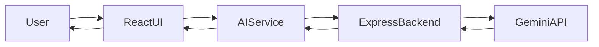
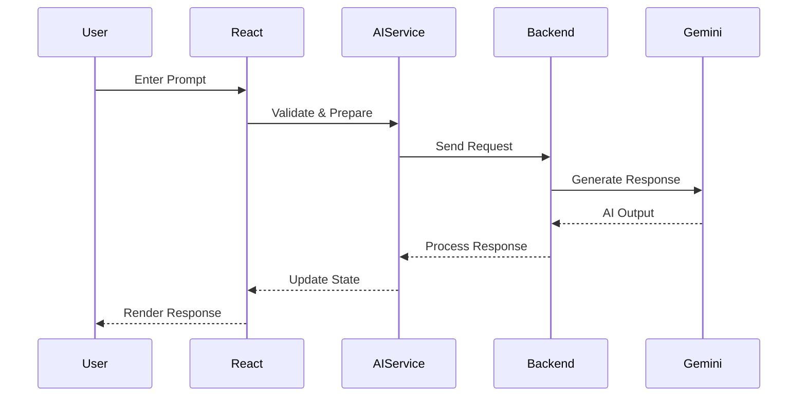
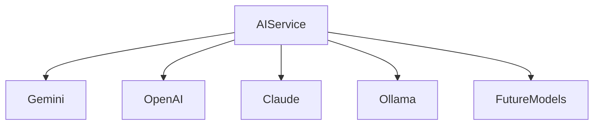
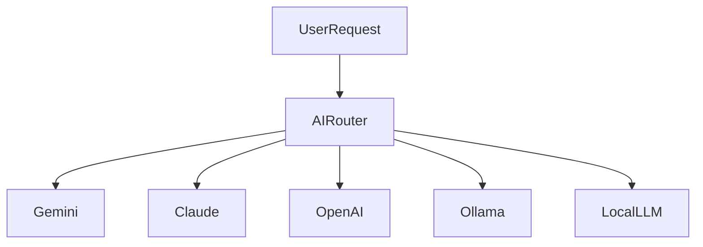
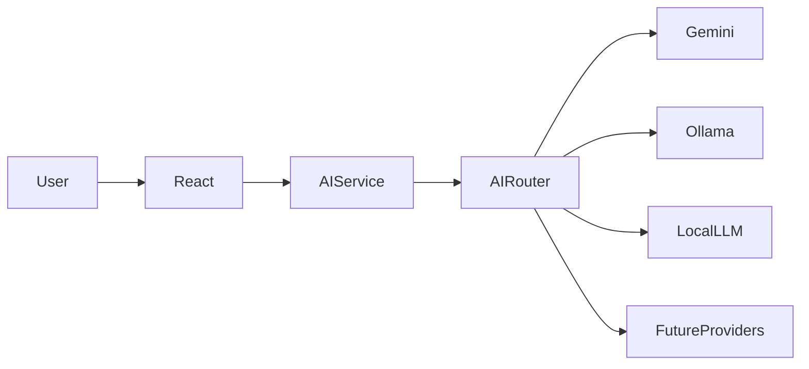
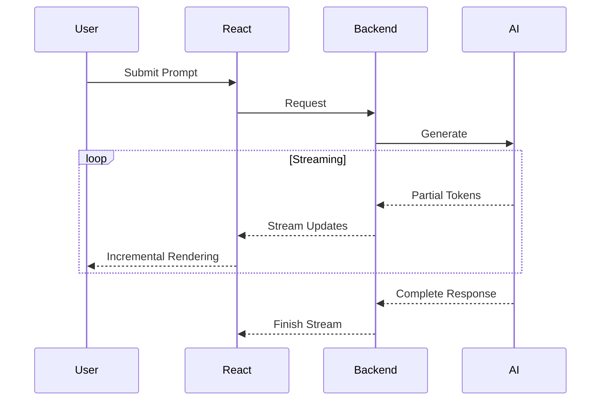
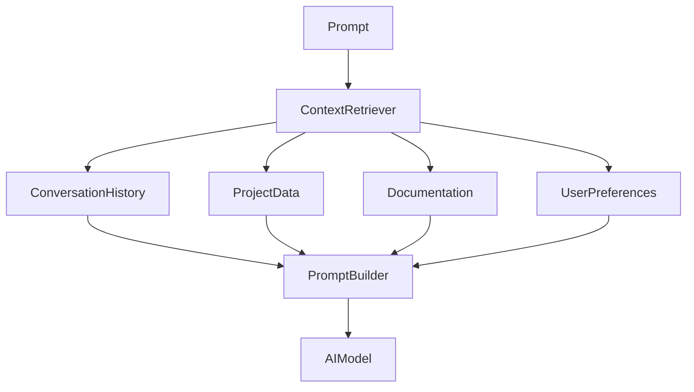

# AI_SYSTEM.md

> *This document explains how the AI subsystem inside Solaris is designed, why it is structured the way it is, and how information moves from user input to generated responses. Rather than focusing on a single language model, it documents the complete AI pipeline, including frontend interaction, backend processing, provider abstraction, response rendering, and future expansion.*

---

# Table of Contents

* Introduction
* AI Philosophy
* Why AI Exists in Solaris
* Design Goals
* High-Level AI Architecture
* Core AI Components
* Prompt Lifecycle
* Frontend Responsibilities

---

# Introduction

Artificial intelligence is the defining capability of Solaris, but it is deliberately not the center of its architecture.

Many AI-powered applications are little more than a chat interface connected directly to a language model. They answer questions effectively, but conversations often remain isolated from the broader workflow. Once the discussion ends, the context disappears and users return to switching between editors, documentation, browsers, and development tools.

Solaris approaches the problem differently.

The AI system is treated as one service inside a larger engineering environment rather than the application itself. Conversations exist alongside projects, research, documentation, visual modules, and future development tools. The language model becomes another component that supports the workflow instead of replacing it.

This distinction influences every architectural decision described throughout this document.

---

# AI Philosophy

The AI subsystem was designed around a simple principle.

**The AI should assist the user without becoming the application.**

Instead of forcing every interaction through a conversational interface, Solaris attempts to integrate intelligent assistance into a modular workspace where AI becomes one part of a broader engineering experience.

This philosophy produces several practical benefits.

The user remains in control of the workflow.

Projects continue existing beyond individual conversations.

Future modules can reuse AI capabilities without depending on a single chat interface.

As the application evolves, intelligence becomes a shared platform instead of an isolated feature.

---

## AI as an Engineering Tool

Large language models excel at accelerating tasks that involve language, reasoning, summarization, explanation, and code generation.

They do not replace engineering judgment.

Throughout Solaris, AI is viewed as a collaborator that reduces repetitive work while leaving architectural decisions, implementation details, debugging, verification, and long-term planning under human control.

That same philosophy influenced the development of Solaris itself.

AI tools were used to explore unfamiliar concepts, accelerate research, explain documentation, and assist with implementation, while the system architecture, project organization, customization, integration, testing, and continuous refinement remained deliberate engineering decisions.

---

# Why AI Exists in Solaris

The purpose of AI inside Solaris extends beyond answering questions.

The long-term objective is to provide intelligent assistance throughout the development process.

Examples include:

* Explaining technical concepts
* Assisting with programming
* Summarizing documentation
* Generating implementation ideas
* Supporting research
* Organizing information
* Accelerating debugging
* Improving developer productivity

These capabilities share one common goal.

They reduce friction between identifying a problem and making progress toward solving it.

Rather than replacing traditional development tools, the AI subsystem complements them by providing contextual assistance whenever it is useful.

---

# Design Goals

Several architectural principles guide every AI-related implementation.

---

## Separation of Responsibilities

The user interface should never contain provider-specific implementation.

React components remain focused on presentation and interaction.

Communication with language models occurs through dedicated services.

Backend infrastructure manages external providers.

Keeping these layers separate allows the AI system to evolve without forcing large changes throughout the application.

---

## Provider Independence

Solaris intentionally avoids coupling the application to a single language model.

Although Google Gemini currently powers the system, the surrounding architecture assumes that providers may change over time.

The frontend communicates with an internal AI service rather than Gemini directly.

This abstraction makes future migration considerably easier.

---

## Maintainability

AI integrations evolve rapidly.

APIs change.

Models improve.

Pricing structures shift.

New capabilities become available.

Maintaining a clean separation between application logic and provider-specific implementation reduces the effort required to adapt to those changes.

---

## Scalability

The AI subsystem has been designed with future growth in mind.

Current conversations represent only one application of intelligent assistance.

The same architecture should eventually support:

* Project-aware assistants
* Workspace memory
* Documentation analysis
* Multiple AI models
* Local inference
* Specialized engineering tools

Planning for this growth early reduces the need for disruptive architectural changes later.

---

# High-Level AI Architecture

At a system level, AI communication follows a layered architecture.

Each layer performs a distinct responsibility before passing information to the next.



This structure creates a clear separation between presentation, application logic, backend communication, and external services.

Each layer can evolve independently while preserving the overall workflow.

---

# AI Processing Layers

The AI subsystem can also be viewed as a collection of cooperating layers.

```text
┌──────────────────────────────┐
│           User               │
├──────────────────────────────┤
│      React Interface         │
├──────────────────────────────┤
│        AI Services           │
├──────────────────────────────┤
│      Express Backend         │
├──────────────────────────────┤
│     External AI Provider     │
└──────────────────────────────┘
```

Each layer communicates only with the layer immediately adjacent to it.

This minimizes coupling while making responsibilities easier to understand.

---

# Core AI Components

Although the AI experience appears as a single interface from the user's perspective, several independent systems cooperate behind the scenes.

```text
AI System
│
├── Prompt Input
├── Conversation Manager
├── Request Builder
├── AI Service
├── Backend Gateway
├── Response Processor
├── Markdown Renderer
├── Error Handler
└── Future Context Manager
```

Each component focuses on one stage of the interaction lifecycle.

Rather than allowing a single module to coordinate every operation, responsibilities remain distributed across specialized systems.

This organization simplifies debugging while encouraging reuse throughout the application.

---

# Prompt Lifecycle

Every conversation follows a consistent sequence.

The user submits a prompt.

The frontend validates the request.

Application state updates to indicate that processing has begun.

The request is forwarded through the AI service to the backend.

The backend communicates with the external provider.

The generated response returns through the same layers before being rendered inside the interface.

A simplified representation appears below.



Maintaining a predictable lifecycle makes future features—such as streaming responses, conversation history, provider selection, and intelligent routing—much easier to implement.

---

# Frontend Responsibilities

The frontend is responsible for creating a responsive user experience while remaining largely unaware of the underlying AI provider.

Its responsibilities include:

* Capturing user input
* Validating prompts
* Managing loading states
* Updating conversation history
* Rendering responses
* Displaying errors
* Coordinating interface state

The frontend deliberately avoids direct communication with external AI providers.

Instead, it delegates that responsibility to the AI service layer.

This architectural boundary keeps presentation logic focused on interaction while allowing backend infrastructure to evolve independently.

---

# User Experience Considerations

A successful AI interaction depends on more than response quality.

Users expect immediate feedback after submitting a prompt, even while generation is still in progress.

For that reason, Solaris emphasizes clear loading indicators, predictable state transitions, and responsive interface updates throughout the interaction lifecycle.

The objective is to make waiting feel intentional rather than uncertain.

As additional capabilities such as streaming responses and persistent conversation memory are introduced, preserving that responsiveness will remain a central design goal.

---

---

# Backend AI Service

The backend forms the boundary between Solaris and every external AI provider. Although users interact exclusively with the frontend, every request ultimately passes through the backend before reaching a language model.

This architectural decision solves several practical problems at once.

API credentials remain protected.

Provider-specific logic stays isolated from the interface.

Requests can be validated before leaving the application.

Responses can be normalized before returning to the client.

Future AI providers can be introduced without requiring changes throughout the frontend.

Rather than acting as a second application, the backend serves as an orchestration layer. It coordinates communication while allowing the frontend to remain focused on user interaction.

---

# Why an AI Service Layer Exists

Connecting React directly to a language model would certainly reduce the amount of code required for an early prototype.

It would also create several long-term problems.

The frontend would become tightly coupled to one provider.

Authentication secrets would become difficult to protect.

Provider-specific request formats would spread across multiple components.

Migrating to another model would require significant refactoring.

Solaris avoids these issues by introducing an internal AI service.

The frontend communicates with one consistent interface regardless of which provider eventually generates the response.

This separation keeps the application modular while reducing long-term maintenance costs.

---

# Request Processing Pipeline

Every prompt follows a predictable sequence before reaching the language model.


Each stage performs a clearly defined task.

Validation ensures the request is suitable for processing.

The request builder prepares provider-independent data.

The backend manages communication.

The response parser converts provider output into a format the interface understands.

Finally, the renderer presents the completed response.

Keeping each stage isolated makes debugging considerably easier.

---

# Request Validation

Every interaction begins with validation.

Although language models are highly flexible, the surrounding application still benefits from consistent request handling.

Validation responsibilities include:

* Empty prompt detection
* Invalid request filtering
* Input normalization
* Request formatting
* Future rate limiting
* Future conversation context preparation

Handling these concerns before contacting the provider reduces unnecessary API usage while improving reliability.

---

# Gemini Integration

Google Gemini currently serves as the primary language model powering Solaris.

The architecture intentionally treats Gemini as an interchangeable provider rather than a permanent dependency.

This distinction influences how communication is implemented.

The frontend never constructs Gemini-specific requests.

Instead, provider formatting occurs within the backend.

Likewise, responses are processed before reaching the interface so React components remain unaware of provider-specific implementation details.

Should Solaris migrate to another model in the future, most frontend code would remain unchanged.

---

# Provider Abstraction

The abstraction layer allows multiple providers to share the same interface.



Every provider implements a common contract.

The application communicates with the abstraction rather than the individual model.

This design greatly reduces vendor lock-in while encouraging experimentation with different AI systems.

---

# Context Management

One of the most challenging aspects of conversational AI is maintaining useful context without overwhelming the model.

Current conversations primarily rely on sequential interaction.

Future versions of Solaris aim to expand this considerably.

Potential context sources include:

* Previous conversation history
* Active workspace
* Current project
* Open documentation
* User preferences
* Attached files
* Retrieved knowledge

A conceptual context pipeline appears below.


Rather than treating prompts as isolated requests, future versions will gradually build richer contextual understanding from multiple parts of the application.

---

# Response Processing

Language models often return information in multiple formats.

Examples include:

* Plain text
* Markdown
* Lists
* Tables
* Source code
* Technical documentation
* Mathematical notation

Before responses reach the interface, the backend processes them into a consistent representation.

This normalization reduces frontend complexity while ensuring the rendering pipeline remains predictable regardless of provider.

Future improvements may include structured output parsing and richer content handling.

---

# Rendering Pipeline

After processing, responses return through several frontend stages.


Separating rendering from provider communication keeps presentation logic clean while allowing future rendering capabilities to evolve independently.

Potential additions include syntax highlighting, interactive diagrams, mathematical rendering, and embedded visualizations.

---

# Error Handling

AI systems inevitably encounter failures.

Network interruptions occur.

Providers become temporarily unavailable.

Requests time out.

Responses occasionally fail validation.

Rather than exposing raw provider errors directly to users, Solaris attempts to translate failures into clear, actionable feedback.

Error handling occurs at multiple layers.

The frontend validates user interaction.

The AI service coordinates request management.

The backend handles provider communication.

External errors are transformed into application-specific responses before reaching the interface.

This layered strategy improves both reliability and user experience.

---

# Security

Security considerations influenced the AI subsystem from its earliest iterations.

Sensitive credentials remain outside the frontend.

Requests pass through a controlled backend rather than directly contacting external providers.

Environment variables isolate confidential configuration from source code.

Future authentication systems can integrate naturally because communication already passes through the backend boundary.

Although Solaris currently operates as a personal engineering project, these architectural choices align with practices commonly used in production environments.

---

# Performance Optimization

Perceived performance matters as much as raw response speed.

Several design decisions contribute to a smoother experience.

Loading indicators appear immediately after submission.

Request handling remains asynchronous.

Application state updates independently from provider processing.

Rendering occurs only after normalized responses are available.

Future improvements may include response streaming, incremental rendering, intelligent caching, and background context preparation.

These optimizations aim to reduce waiting without introducing unnecessary architectural complexity.

---

# Multi-Model Architecture

The current implementation communicates with a single provider.

The surrounding architecture assumes this will eventually change.

Different language models excel at different tasks.

One may perform better for programming.

Another may excel at summarization.

A third may specialize in document analysis.

Rather than forcing every request through one provider, future versions of Solaris may intelligently select the most appropriate model based on the user's task.



The routing layer would remain invisible to users while improving flexibility and reducing dependency on any individual provider.

---

# Engineering Notes

Building the AI subsystem required balancing simplicity with extensibility.

Many architectural decisions appear larger than the current implementation requires.

That was intentional.

Separating frontend interaction, backend communication, provider abstraction, and response rendering introduces additional structure today, but it dramatically reduces future complexity as Solaris expands.

The AI subsystem is therefore designed not only to support current functionality, but also to provide a stable foundation for capabilities that have not yet been implemented.

---
---

# Local AI Support

One of the long-term goals of Solaris is to support language models that run entirely on the user's own hardware.

Today, the application communicates with Google Gemini through a backend service because it provides reliable performance, strong reasoning capabilities, and a straightforward integration workflow. While cloud-hosted models offer significant advantages, they are not the only direction the project is intended to take.

Local models introduce a different set of possibilities.

Users gain complete control over their data.

Internet connectivity is no longer required for every interaction.

Response latency can become more predictable once models are loaded into memory.

Specialized models can be selected for individual engineering tasks rather than relying on a single general-purpose assistant.

Supporting local inference requires considerably more infrastructure than changing an API endpoint. Model management, hardware detection, memory allocation, and runtime optimization all become responsibilities of the application itself.

For that reason, local AI is treated as a long-term architectural objective rather than a short-term feature.

---

# Local AI Architecture

The surrounding architecture has already been designed so that local models can be introduced alongside cloud providers instead of replacing them.



The frontend continues communicating with the same AI service regardless of where inference occurs.

Only the routing layer determines which provider processes the request.

This keeps the user experience consistent while allowing the underlying infrastructure to evolve independently.

---

# Streaming Responses

Current AI interactions follow a request-response model.

The user submits a prompt.

The backend waits for the provider to complete generation.

The finished response is returned to the interface.

Although this workflow is reliable, it introduces a noticeable delay for longer generations.

Streaming changes this interaction model.

Instead of waiting for the entire response, generated text is delivered incrementally as it becomes available.

Users begin reading almost immediately while the remainder of the response continues generating in the background.

The perceived performance improvement is often greater than the actual reduction in generation time.

---

## Future Streaming Pipeline



Supporting streaming requires modifications throughout the request lifecycle.

Frontend components must render partial output.

Backend services must forward streamed data efficiently.

Application state must distinguish between active and completed responses.

Despite the added complexity, streaming represents one of the most valuable future improvements for user experience.

---

# Memory Systems

Current conversations are primarily contextual within a single session.

Long-term development aims to expand that capability through persistent memory.

Rather than remembering every interaction indefinitely, Solaris is expected to organize memory into meaningful categories.

Examples include:

* Conversation history
* Active projects
* User preferences
* Frequently referenced documentation
* Workspace context
* Saved research

The objective is not simply storing more information.

The objective is retrieving the right information at the appropriate moment.

A carefully designed memory system reduces repetitive prompting while improving the relevance of generated responses.

---

# Context Retrieval

Future AI systems will likely rely on retrieval rather than increasing prompt size indefinitely.

A conceptual workflow appears below.



This retrieval-first approach scales significantly better than repeatedly sending entire conversations to the language model.

It also creates opportunities for project-aware assistants and intelligent documentation systems.

---

# AI Safety

Artificial intelligence is powerful because it can generate convincing information quickly.

That capability also introduces responsibility.

Solaris approaches AI as an assistant rather than an authority.

Generated responses should support decision-making rather than replace critical thinking.

Users remain responsible for reviewing technical recommendations, verifying factual information, and validating generated code before deploying it.

Within the application, architectural decisions attempt to reduce unnecessary risk by isolating provider communication, validating requests, handling failures gracefully, and presenting generated information transparently.

As AI capabilities continue evolving, safety will remain an ongoing engineering consideration rather than a one-time implementation task.

---

# Reliability

Reliability depends on more than the quality of the underlying language model.

Network conditions change.

External providers experience outages.

Requests occasionally fail.

Rate limits may temporarily interrupt communication.

Solaris therefore separates reliability into multiple layers.

Frontend validation reduces invalid requests.

Backend processing manages communication.

Provider abstraction enables future failover strategies.

Consistent response formatting keeps rendering predictable.

Designing for failure often produces stronger software than designing exclusively for success.

---

# Future Roadmap

The AI subsystem is expected to evolve substantially over time.

Several areas currently under consideration include:

### Short-Term

* Improved prompt handling
* Better response rendering
* Rich markdown support
* Enhanced conversation management
* More informative error handling

### Medium-Term

* Streaming responses
* Persistent workspace memory
* Project-aware conversations
* Multiple AI providers
* Better context retrieval

### Long-Term

* Local AI execution
* Intelligent provider routing
* Retrieval-Augmented Generation (RAG)
* Voice interaction
* Multimodal reasoning
* Autonomous engineering workflows
* Plugin-based AI tools
* Custom reasoning pipelines

Rather than viewing these objectives as fixed milestones, they represent architectural directions that align with the modular design established throughout Solaris.

---

# Engineering Lessons

Developing the AI subsystem provided lessons that extend beyond artificial intelligence itself.

One of the earliest realizations was that connecting a language model to a user interface is relatively straightforward. Building a maintainable system around that connection is considerably more challenging.

Separating presentation from communication, introducing reusable services, creating backend abstractions, and documenting architectural decisions required significantly more engineering effort than sending prompts to an API.

Another important lesson involved balancing flexibility with simplicity.

It is easy to over-engineer an AI system by introducing abstractions before they become useful.

It is equally easy to tightly couple every component until future expansion becomes difficult.

Much of Solaris has evolved through finding a balance between those extremes.

Finally, working with AI during development reinforced an important principle.

AI can accelerate learning and implementation, but it does not replace understanding. Every architectural decision, refactor, integration, debugging session, and customization required deliberate engineering judgment. AI functioned as a development assistant rather than an autonomous software engineer.

---

# Long-Term Vision

The long-term objective of Solaris is not simply to become another AI chat application.

The vision is broader.

Solaris aims to become a modular engineering workspace where intelligent assistance is naturally integrated into research, software development, technical writing, visualization, experimentation, and learning.

In that environment, AI becomes part of the workflow instead of the destination.

Users should be able to move seamlessly between conversations, projects, documentation, simulations, and development tools while maintaining context throughout the entire process.

Achieving that vision depends less on selecting the most capable language model and more on building an architecture that can adapt as AI technology continues to evolve.

---

# Closing Notes

Artificial intelligence changes rapidly.

Models improve.

APIs evolve.

Entire categories of tools appear within months rather than years.

Because of that pace, the architecture surrounding AI often becomes more valuable than the individual provider powering it.

Solaris has therefore been designed around adaptability.

The frontend communicates through stable interfaces.

Backend services isolate external providers.

The AI subsystem remains modular.

Future capabilities—whether cloud-based, local, or hybrid—can extend the existing architecture instead of replacing it.

Like the rest of the project, this document represents a snapshot of an evolving system.

As Solaris continues to grow, the implementation will change, new capabilities will emerge, and some architectural decisions will inevitably be revisited.

That evolution is expected.

Well-designed software is not defined by remaining unchanged. It is defined by its ability to improve without losing clarity, maintainability, or purpose.

---

