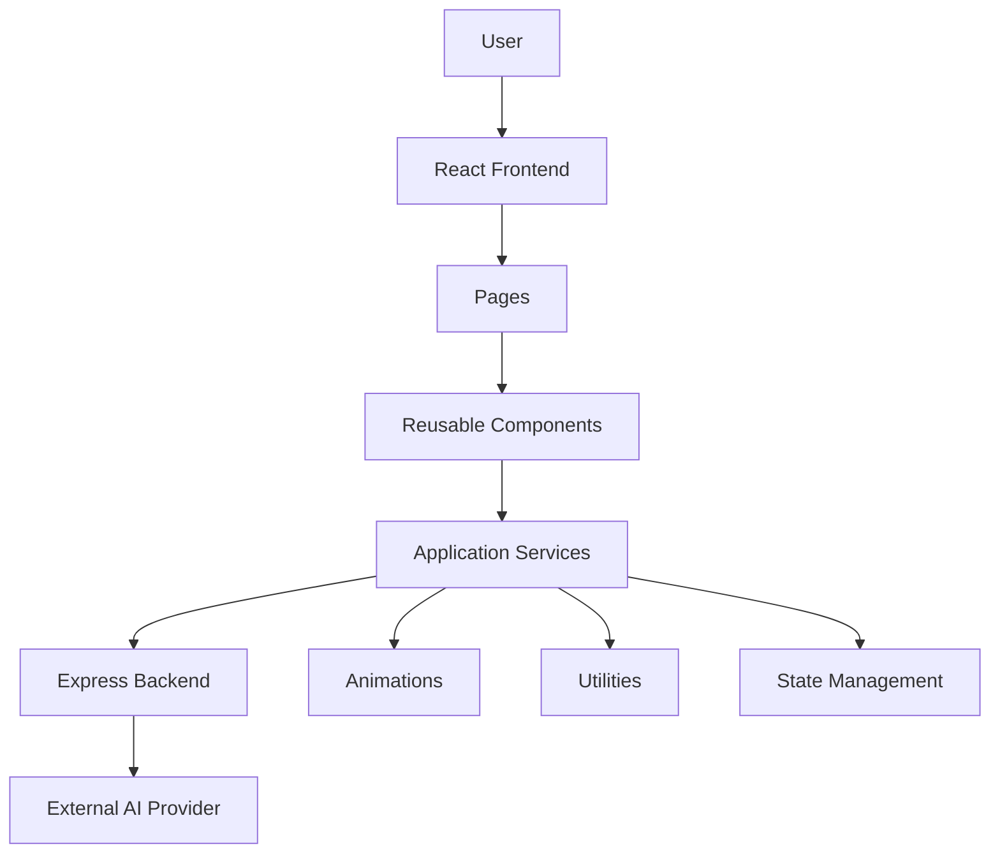
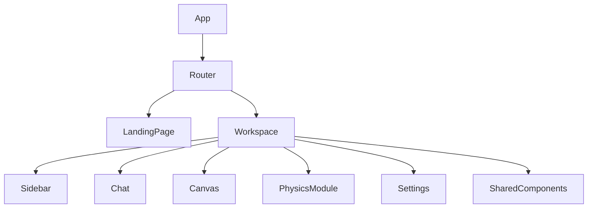
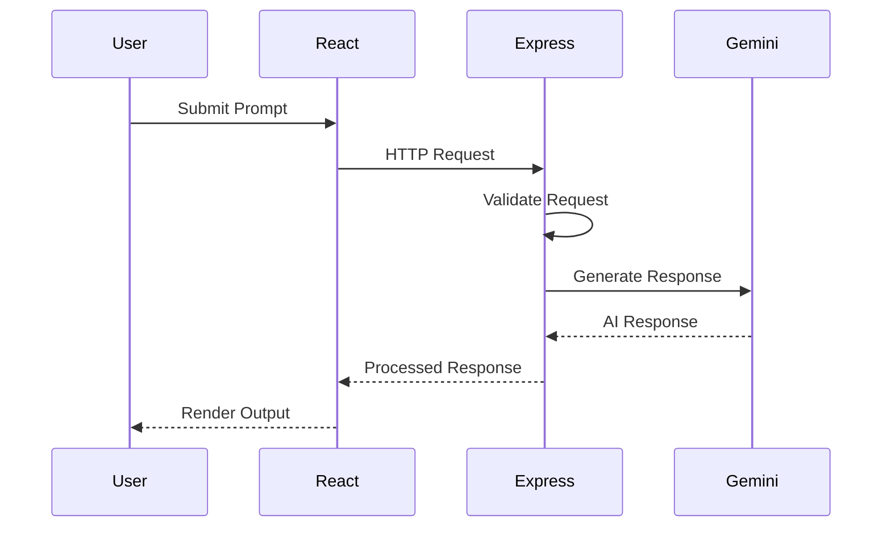
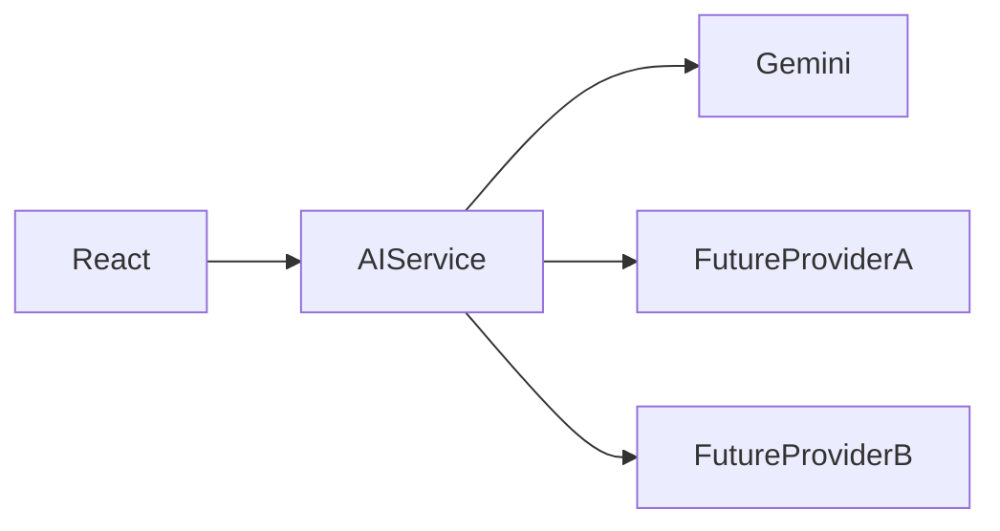
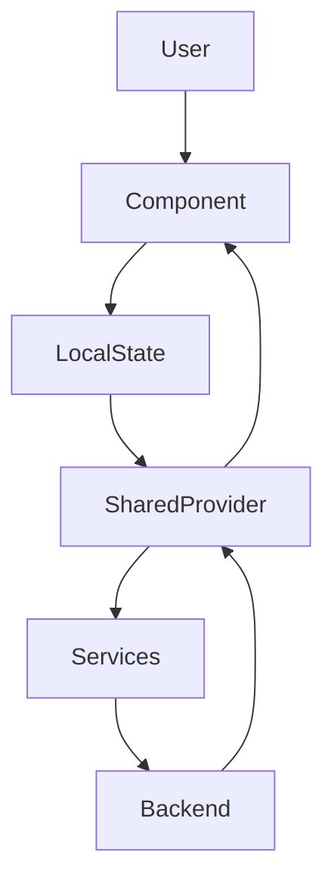
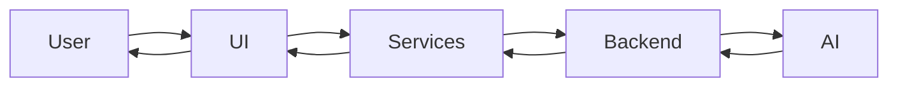
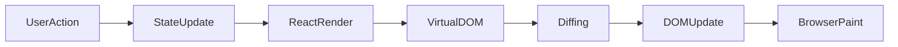
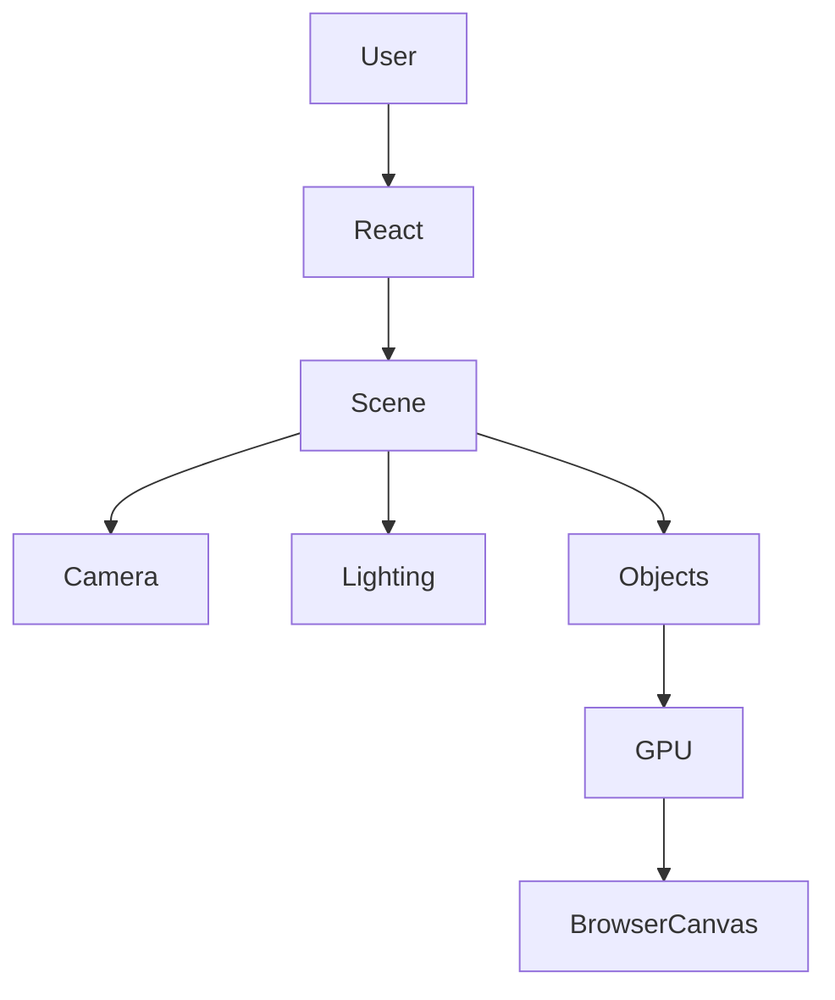
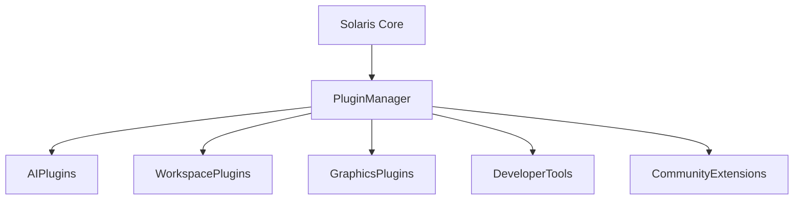
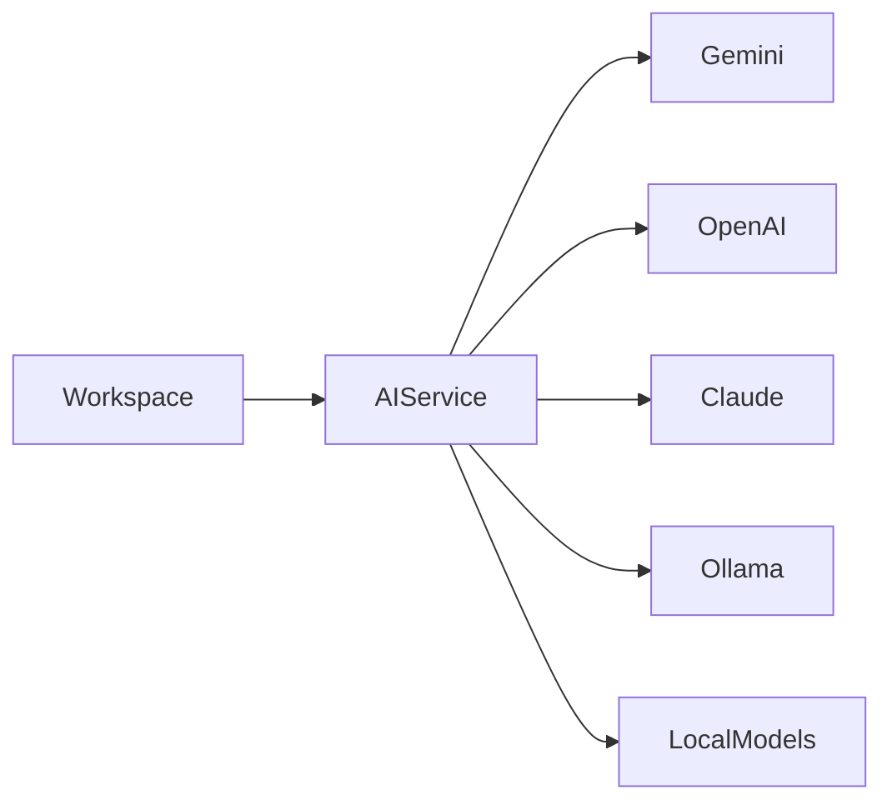

# ARCHITECTURE.md

> *This document explains how Solaris is organized internally, why particular architectural decisions were made, and how different parts of the system interact. Rather than listing technologies, it focuses on the reasoning behind the implementation and the trade-offs made during development.*

---

# Table of Contents

* Architecture Philosophy
* Design Goals
* High-Level Architecture
* System Layers
* Frontend Architecture
* Component Organization
* Service Layer
* Folder Organization
* Design Principles

---

# Architecture Philosophy

Software architecture is less about choosing technologies and more about deciding how complexity should be managed as a project grows.

Solaris began as a relatively small experiment. At first, most features lived close together because the application was simple enough that strict organization provided little benefit. As new modules were added, that approach quickly became difficult to maintain. Components accumulated responsibilities that were only loosely related to one another, repeated logic appeared in different parts of the application, and introducing new functionality required modifying code that should have remained independent.

Those experiences shaped the current architecture.

Rather than treating architecture as something that exists only for large projects, Solaris treats it as a tool for keeping future development manageable. Every structural decision aims to reduce coupling, improve readability, and make individual modules easier to replace without affecting the rest of the application.

The architecture continues to evolve. Refactoring is considered a normal part of development rather than an indication that an earlier implementation failed. As new patterns prove more effective, existing code is reorganized to reflect a better understanding of the problem.

---

# Design Goals

Several principles guide architectural decisions throughout the project.

### Modularity

Independent features should remain independent.

Adding or removing functionality should affect as little of the surrounding code as possible. Components, services, and utilities are separated so they can evolve without forcing unrelated parts of the application to change.

This approach becomes increasingly valuable as the project grows because complexity remains localized instead of spreading throughout the codebase.

---

### Separation of Responsibilities

Each layer of Solaris exists for a specific purpose.

The frontend presents information and responds to user interaction.

Application services coordinate logic shared between multiple components.

The backend manages communication with external providers.

External APIs remain isolated behind dedicated interfaces.

Keeping these responsibilities separate reduces unintended dependencies and makes debugging significantly easier.

---

### Maintainability

Software is rewritten far more often than it is started.

For that reason, Solaris prioritizes code that is understandable several months later rather than code that is merely concise today.

Folder organization, naming conventions, reusable abstractions, and consistent patterns all contribute to reducing the cost of future maintenance.

---

### Incremental Evolution

Solaris was never designed around a fixed specification.

Instead, the architecture expects new requirements to appear over time.

Rather than attempting to predict every future feature, the project is organized so that additional functionality can be introduced with minimal disruption to existing systems.

---

# High-Level Architecture

At a high level, Solaris follows a layered architecture.



Each layer performs a different responsibility.

The interface handles presentation.

Components organize reusable interface elements.

Services coordinate business logic.

The backend communicates with external systems.

Keeping these responsibilities separated allows individual parts of the project to change without introducing unnecessary coupling across the rest of the application.

---

# System Layers

Solaris can be viewed as five cooperating layers.

```
┌──────────────────────────────┐
│          User Interface      │
├──────────────────────────────┤
│      React Components        │
├──────────────────────────────┤
│     Services & Utilities     │
├──────────────────────────────┤
│      Express Backend         │
├──────────────────────────────┤
│     External AI Providers    │
└──────────────────────────────┘
```

Each layer depends only on the layer immediately below it.

The user never communicates directly with backend services.

Components do not directly manage external API communication.

External providers never interact with the interface.

This separation simplifies testing and reduces the number of places where implementation details become tightly coupled.

---

# Frontend Architecture

The frontend is responsible for presenting information, responding to user interaction, and coordinating communication with the underlying service layer.

React was chosen because its component model naturally encourages decomposition.

Instead of constructing one large interface, Solaris is built from smaller pieces that each solve a specific problem.

Examples include navigation, workspace panels, interactive modules, visual effects, and reusable interface controls.

Each component owns only the logic required for its own behavior.

Whenever logic becomes useful across multiple components, it is extracted into a reusable hook, service, or utility.

This keeps components relatively small while allowing common functionality to remain centralized.

---

## Component Hierarchy

A simplified representation of the interface hierarchy appears below.



The hierarchy is intentionally shallow where possible.

Large components are decomposed into smaller building blocks rather than accumulating responsibilities inside a single file.

As Solaris expands, this organization makes it easier to isolate bugs, replace individual modules, and understand how data moves through the interface.

---

# Component Organization

Components are grouped according to responsibility instead of visual appearance.

For example:

* Interface controls remain together.
* Layout components remain together.
* Shared UI elements remain together.
* Experimental modules remain isolated from production-ready components.

This organization makes navigation through the repository significantly easier than grouping files only by file type.

Developers can usually predict where a new component belongs without searching across unrelated directories.

---

# Service Layer

One of the most important architectural decisions in Solaris is separating application logic from presentation.

Instead of allowing React components to communicate directly with every external dependency, shared behavior is placed inside dedicated services.

Examples include:

* AI communication
* API requests
* Shared utilities
* Data transformation
* Future persistence layers

The service layer reduces duplication because multiple components can reuse the same implementation.

It also improves maintainability.

When an external API changes, modifications usually remain isolated inside one service rather than requiring updates throughout the interface.

This separation has already simplified several refactoring efforts during development.

---

# Folder Organization

Although exact folders continue to evolve, the repository follows a consistent organizational strategy.

```text
src
│
├── components
├── pages
├── hooks
├── services
├── providers
├── animations
├── assets
├── styles
├── utils
├── types
└── App.tsx
```

Each directory represents a distinct responsibility.

**components** contain reusable interface elements.

**pages** define top-level application views.

**hooks** encapsulate reusable React behavior.

**services** coordinate business logic and communication.

**providers** manage shared application context.

**animations** isolate motion-related functionality.

**utils** contain helper functions used throughout the application.

**types** centralize shared TypeScript definitions.

This organization reduces duplication and makes future refactoring significantly easier.

---

# Design Principles

Several engineering principles influence every architectural decision inside Solaris.

### Build for Change

Requirements evolve.

Architecture should expect that rather than resisting it.

Components are designed so future implementations can replace earlier ones without requiring widespread rewrites.

---

### Minimize Coupling

Dependencies should remain explicit.

Components communicate through clearly defined interfaces instead of hidden assumptions.

Reducing coupling improves maintainability and lowers the risk that changes in one module unexpectedly affect another.

---

### Maximize Reuse

Reusable code is easier to maintain than duplicated code.

Whenever functionality becomes useful across multiple parts of the application, it is extracted into shared services, utilities, or components.

The objective is not simply reducing lines of code.

It is reducing the number of places where future bugs must be fixed.

---

### Learn Through Refactoring

Many architectural improvements inside Solaris were discovered only after earlier implementations exposed their limitations.

Rather than preserving original code indefinitely, the project embraces refactoring as part of the engineering process.

Each redesign reflects a better understanding of the problem rather than dissatisfaction with earlier work.

As Solaris continues to evolve, this philosophy will remain one of the defining characteristics of the project.

---

---

# Backend Architecture

The backend exists for one reason: to separate the user interface from external services.

At first glance, allowing the React application to communicate directly with an AI provider might appear simpler. For small experiments that approach can work, but it quickly introduces problems. API keys become harder to protect, provider-specific logic spreads throughout the frontend, and replacing one model with another often requires modifications across multiple components.

Solaris avoids those problems by introducing a dedicated Express service layer.

The backend acts as the application's gateway. Every request from the frontend passes through this layer before reaching an external AI provider. That single decision keeps communication centralized and gives the project a clear boundary between presentation and infrastructure.

The backend is intentionally lightweight. It does not attempt to own application state or duplicate frontend logic. Instead, it focuses on tasks that naturally belong on the server.

These responsibilities include:

* Request validation
* API authentication
* Provider communication
* Error handling
* Response formatting
* Future middleware
* Logging
* Rate limiting
* Analytics

As Solaris grows, additional providers and backend services can be introduced without restructuring the frontend.

---

# Backend Request Lifecycle

Every interaction between the interface and an external AI model follows a predictable sequence.



Each stage performs a specific responsibility.

The React client focuses entirely on interaction.

Express manages communication.

Gemini performs inference.

Keeping those concerns isolated makes the system easier to extend and considerably easier to debug.

---

# AI Integration

Solaris treats AI as an application service rather than the application itself.

That distinction influences nearly every architectural decision.

The interface does not assume a specific provider.

Components should never know whether the response originated from Gemini or another model introduced later.

Instead, they communicate with an internal service that exposes a consistent interface regardless of the underlying provider.

Today that provider is Google Gemini.

Tomorrow it could be a local model, OpenAI-compatible endpoint, Claude, or another service entirely.

The frontend should remain unchanged.

That abstraction reduces vendor lock-in and keeps future migration costs low.

---

# AI Service Abstraction

A simplified representation appears below.



Every provider should expose the same high-level interface.

This design removes provider-specific logic from React components and concentrates it inside one location.

If request formats change, only the service layer requires modification.

---

# State Management

Modern interfaces rarely consist of independent pages.

Components influence one another continuously.

Navigation changes workspace state.

Workspace state affects AI conversations.

AI responses modify displayed information.

Animations react to application state.

Without careful organization these interactions quickly become difficult to manage.

Solaris therefore separates transient interface state from reusable application logic.

State is kept as close as possible to the component that owns it.

When multiple parts of the application require the same information, shared state is elevated through providers or centralized abstractions instead of duplicated across unrelated components.

This approach reduces unnecessary synchronization while keeping ownership explicit.

---

# State Flow



Information always has a clear direction.

Components request data.

Services coordinate communication.

Providers distribute shared information.

Rendering reacts to state changes rather than manually updating the interface.

---

# Services

One architectural lesson became clear during development.

Whenever business logic lives directly inside interface components, those components become difficult to understand.

Solaris therefore moves reusable behavior into dedicated services whenever possible.

Typical responsibilities include:

* AI communication
* Request construction
* Response transformation
* Data formatting
* Shared utilities
* Future storage mechanisms

Components become significantly smaller because they focus primarily on rendering and interaction.

The service layer becomes the location where application behavior lives.

This separation reduces duplication and makes testing individual functionality much easier.

---

# Data Flow

Information moves through Solaris in one direction.

The user interacts with the interface.

The interface requests work from services.

Services communicate with the backend.

The backend communicates with external providers.

Results travel back through the same layers.



A predictable flow simplifies reasoning about the application.

Unexpected side effects become easier to identify because every layer has a clearly defined responsibility.

---

# Error Handling

Failures are expected.

Network interruptions occur.

External APIs become unavailable.

Requests time out.

Malformed responses occasionally appear.

Rather than assuming success, Solaris attempts to isolate failures at the layer where they occur.

Validation begins before requests leave the frontend.

Backend services perform additional checks before contacting external providers.

Responses are normalized before returning to the client.

The interface remains responsible for communicating failures to users without exposing implementation details.

As additional providers are introduced, consistent error handling will become increasingly important.

---

# Internal Communication

Communication between modules favors explicit interfaces over direct dependencies.

Instead of allowing unrelated components to access one another's internal state, shared behavior passes through services, providers, or reusable abstractions.

This approach reduces coupling.

Individual modules remain easier to replace because they communicate through well-defined boundaries rather than assumptions about internal implementation.

As the repository expands, maintaining those boundaries becomes increasingly valuable.

---

# Security Considerations

Although Solaris is currently an actively developed personal project rather than a production platform, several architectural choices were made with security in mind.

External API keys remain outside the frontend.

Provider communication occurs through the backend.

Sensitive configuration is isolated using environment variables.

Future authentication and authorization systems can be introduced without restructuring the interface because the backend already serves as the application's communication boundary.

Security should grow alongside functionality rather than being introduced only after features have been completed.

---

# Scalability

The current architecture is intentionally larger than the project's immediate requirements.

Some abstractions exist not because today's implementation demands them, but because future versions almost certainly will.

Introducing a second AI provider, additional workspace modules, persistent project memory, or collaborative functionality should extend existing layers rather than replacing them.

Designing for reasonable growth does not mean predicting every future requirement.

It means reducing the cost of change when those requirements eventually appear.

---

# Engineering Perspective

Many student projects begin by solving the immediate problem.

Solaris increasingly tries to solve the next problem as well.

The goal is not to introduce unnecessary abstraction.

The goal is to recognize patterns early enough that repeated solutions become reusable architecture instead of duplicated implementation.

That mindset has influenced every major refactor carried out during development and continues to shape how new features are designed before they become part of the codebase.

---

---

# Performance Engineering

Performance has influenced the architecture of Solaris from the beginning, although the priorities have changed as the project has grown.

Early development focused on implementing features as quickly as possible. That approach encouraged experimentation and made it easier to evaluate new ideas, but it also exposed areas where unnecessary rendering, duplicated logic, and oversized components reduced responsiveness.

Rather than treating optimization as a final stage of development, Solaris approaches performance as an ongoing architectural concern. Every major refactor aims to improve maintainability first, with performance improvements following naturally from clearer abstractions and better separation of responsibilities.

The objective is not to produce the smallest possible benchmark numbers. The objective is to create an interface that feels responsive while remaining understandable to maintain and extend.

---

# Performance Philosophy

Optimization without measurement often increases complexity without providing meaningful benefits.

Solaris follows three practical principles.

### Optimize the User Experience

Users perceive performance through responsiveness rather than benchmark results.

Reducing visual latency, keeping navigation smooth, and ensuring immediate feedback after interactions usually contributes more to the overall experience than micro-optimizing individual functions.

For that reason, interface responsiveness receives greater priority than isolated computational improvements.

---

### Keep Rendering Predictable

Rendering should occur because application state changes, not because unrelated components happen to re-render.

React's component model naturally supports this philosophy, provided components remain focused on their own responsibilities.

As the application grows, keeping rendering boundaries well defined becomes increasingly important.

---

### Reduce Complexity Before Optimizing

Complicated code is often slower to maintain than it is to execute.

Several improvements inside Solaris originated from simplifying existing implementations rather than introducing specialized optimization techniques.

Cleaner architecture frequently produces better runtime behavior as a secondary benefit.

---

# React Rendering Pipeline

React updates the interface by comparing the previous virtual component tree with the new one after state changes occur.

Solaris is designed so that most state changes remain localized.

Whenever possible:

* Local state remains inside individual components.
* Shared state is elevated only when multiple components genuinely require it.
* Derived values are calculated instead of stored.
* Components receive only the data necessary for rendering.

This approach reduces unnecessary rendering while keeping data ownership explicit.

A simplified rendering flow appears below.



Every interaction follows this sequence.

By limiting the number of components affected by each state update, Solaris reduces unnecessary work during interface updates.

---

# Component Rendering Strategy

Large components become increasingly difficult to optimize.

Solaris therefore favors smaller reusable components with clearly defined responsibilities.

Instead of constructing one interface responsible for navigation, rendering, business logic, animations, and API communication simultaneously, these concerns remain separated.

Benefits include:

* Smaller rendering boundaries
* Easier debugging
* Better code reuse
* Simpler testing
* Lower cognitive complexity

The objective is not to maximize the number of components.

The objective is to ensure each component performs one primary responsibility well.

---

# State Update Optimization

State management directly influences rendering performance.

Whenever state changes unnecessarily, React must evaluate whether additional rendering is required.

Solaris attempts to minimize this through several architectural decisions.

Shared state exists only where multiple modules require the same information.

Temporary interaction state remains local.

Derived information is calculated from existing state instead of duplicated.

As additional workspace modules are introduced, maintaining these boundaries will become increasingly important.

---

# Three.js Integration

Interactive graphics represent one of the most technically demanding areas of Solaris.

Unlike traditional interface components, Three.js continuously renders frames while a scene remains active.

That introduces architectural considerations beyond ordinary React applications.

Rather than allowing graphics code to spread throughout the interface, interactive scenes remain isolated inside dedicated modules.

This separation prevents rendering logic from affecting unrelated application components and allows graphics experiments to evolve independently.

---

# Graphics Architecture

The rendering pipeline follows a layered approach.



React manages application state and user interaction.

Three.js manages the rendering pipeline.

The browser ultimately presents the rendered frame.

Keeping these responsibilities separate prevents graphics code from becoming tightly coupled to the rest of the interface.

---

# Rendering Considerations

Rendering a three-dimensional scene differs significantly from rendering HTML.

Every frame requires updating transformations, camera positioning, lighting calculations, materials, and object hierarchies before the GPU produces the final image.

Several practices help keep rendering efficient.

Inactive scenes should avoid unnecessary updates.

Objects should be reused whenever practical rather than recreated.

Scene complexity should grow only when visual benefit justifies additional rendering cost.

These principles become increasingly valuable as more interactive modules are introduced.

---

# Animation System

Animations provide visual continuity throughout Solaris.

Their purpose is functional rather than decorative.

Transitions communicate changing application state, help users maintain orientation while navigating, and reduce abrupt interface changes.

Animations should never delay interaction.

Whenever motion competes with responsiveness, responsiveness takes priority.

Keeping animation logic separate from business logic also improves maintainability by allowing visual behavior to evolve independently from application functionality.

---

# Asset Management

Modern frontend applications frequently become slower because of growing asset size rather than computational complexity.

Solaris attempts to organize assets carefully.

Images remain compressed.

Large media files stay outside the primary application bundle whenever practical.

Three-dimensional assets are introduced only when they contribute meaningful interaction rather than visual novelty.

Future versions may introduce additional asset pipelines as interactive content expands.

---

# Bundle Optimization

Application startup depends heavily on the amount of JavaScript delivered to the browser.

Vite already provides efficient production builds, but architectural decisions still influence bundle size.

Reusable modules reduce duplicated implementation.

Unused dependencies are removed rather than retained for convenience.

Features that are not immediately required can be loaded on demand instead of becoming part of the initial application bundle.

As Solaris expands, bundle analysis will become an increasingly valuable development practice.

---

# Lazy Loading Strategy

Not every feature needs to exist immediately after the application loads.

Future versions of Solaris will continue moving toward lazy loading where appropriate.

Examples include:

* Experimental modules
* Three.js scenes
* Administrative tools
* Large visualization components
* Future plugin systems

Loading these features only when requested reduces startup time while preserving functionality.

This strategy becomes increasingly valuable as the project grows beyond its current size.

---

# Measuring Performance

Optimization should be guided by observation rather than assumption.

Future development will increasingly rely on practical measurements such as:

* Initial page load time
* Largest Contentful Paint (LCP)
* Interaction responsiveness
* Memory usage
* JavaScript bundle size
* Rendering frequency
* Network latency
* AI response duration

Collecting meaningful measurements provides a stronger foundation for architectural decisions than intuition alone.

Performance improvements should solve demonstrated problems rather than hypothetical ones.

---

# Engineering Mindset

One lesson became clear during development.

The fastest implementation is rarely the one written first.

Performance improvements often emerged after simplifying architecture, separating responsibilities, and reducing unnecessary complexity.

That pattern continues to guide development.

Instead of viewing optimization as isolated tweaks applied near the end of a project, Solaris treats performance as a consequence of thoughtful engineering decisions made throughout the codebase.

A maintainable architecture naturally creates opportunities for efficient software, while an overly complex architecture eventually limits both performance and future development.

---

---

# Scalability

One of the biggest architectural challenges in any long-term software project is designing for growth without introducing unnecessary complexity.

Solaris does not attempt to predict every future requirement. Instead, it aims to create boundaries that make future changes less expensive. The current architecture intentionally separates presentation, application logic, backend communication, and external services so that new functionality can extend existing systems instead of replacing them.

This philosophy has already influenced several refactoring decisions. Features that originally existed as tightly coupled implementations have gradually been reorganized into reusable components and shared services. Each refactor reduces the effort required to introduce future capabilities.

Scalability, in this context, is not limited to handling more users. It also includes supporting more features, more contributors, larger codebases, and more ambitious engineering goals while keeping the project understandable.

---

# Vertical and Horizontal Growth

Solaris is expected to grow in two different directions.

### Vertical Growth

Vertical growth focuses on improving existing systems.

Examples include:

* Smarter AI conversations
* Richer workspace management
* Better animations
* Improved visual design
* Faster rendering
* More reliable backend services

These improvements deepen the capabilities of features that already exist.

---

### Horizontal Growth

Horizontal growth introduces entirely new modules.

Potential examples include:

* Plugin support
* Local AI execution
* Embedded development tools
* Markdown editor
* Project management dashboard
* Collaborative workspaces
* Knowledge management
* File indexing
* Integrated documentation viewer

The modular architecture allows these systems to exist alongside existing functionality without requiring large-scale redesign.

---

# Engineering Trade-offs

Every architectural decision represents a compromise.

Solaris intentionally favors maintainability over short-term convenience.

For example, introducing an Express backend increases project complexity compared to directly calling an AI provider from the frontend. That additional complexity is justified because it creates a secure communication boundary, centralizes provider logic, and simplifies future expansion.

Similarly, dividing functionality into many reusable components requires more initial planning than writing a single large component. The payoff appears later, when features need to evolve independently and debugging becomes significantly easier.

Throughout the project, architectural choices are evaluated according to long-term impact rather than implementation speed alone.

---

# Dependency Management

Modern JavaScript ecosystems evolve rapidly. New libraries appear every week, but introducing dependencies simply because they are popular often creates long-term maintenance problems.

Solaris follows a conservative approach.

Each dependency should solve a clearly defined problem that would otherwise require substantial custom implementation.

When evaluating a new library, several questions guide the decision.

* Does it significantly improve maintainability?
* Is the project actively maintained?
* Does it reduce complexity rather than introduce it?
* Can it be replaced if necessary?
* Does it integrate naturally with the existing architecture?

Minimizing unnecessary dependencies keeps the project easier to understand and reduces future migration effort.

---

# Future Plugin Architecture

One long-term objective is allowing Solaris to evolve through independently developed modules.

Instead of modifying the application's core whenever new functionality is introduced, future versions may support a plugin architecture.

A simplified concept appears below.



The core application would remain responsible for navigation, shared services, authentication, and application state.

Plugins would contribute specialized functionality while communicating through clearly defined interfaces.

This separation reduces coupling and encourages experimentation without destabilizing the core system.

---

# Future AI Architecture

Current AI integration centers around Google Gemini.

The architecture, however, avoids assuming a single provider.

Future versions may communicate with multiple models simultaneously.



Every provider should expose a common interface.

This abstraction allows providers to change without requiring modifications throughout the frontend.

It also creates opportunities for provider selection, fallback behavior, local execution, and intelligent routing based on task requirements.

---

# Future Workspace Architecture

The current workspace focuses primarily on interaction between users and AI.

Long-term development aims to transform Solaris into a broader engineering environment.

Possible workspace modules include:

* Documentation
* Source code navigation
* Project planning
* Interactive simulations
* AI-assisted debugging
* Research organization
* Visual data exploration
* Knowledge graphs
* Development dashboards

Rather than existing as isolated pages, these modules should cooperate through shared application services and common data structures.

The workspace becomes increasingly valuable as relationships between modules strengthen.

---

# Testing Strategy

Reliable software depends on repeatable verification.

Although Solaris remains under active development, future testing will focus on multiple layers of the architecture.

### Unit Testing

Individual functions, utilities, and services should behave predictably regardless of surrounding application state.

---

### Component Testing

React components should render correctly under different combinations of properties and state.

---

### Integration Testing

Frontend services, backend endpoints, and AI communication should function correctly as complete workflows rather than isolated units.

---

### End-to-End Testing

Representative user interactions should be verified automatically to ensure that major workflows continue functioning as the application evolves.

Testing becomes increasingly valuable as the codebase expands because manual verification grows more expensive over time.

---

# Continuous Refactoring

Architecture is never truly complete.

As Solaris grows, earlier implementations will continue to reveal opportunities for improvement.

Some abstractions will become unnecessary.

Others will prove too limited.

Refactoring is therefore treated as a continuous engineering activity rather than a separate development phase.

The objective is not perfection.

The objective is ensuring that today's design does not prevent tomorrow's ideas.

---

# Long-Term Vision

Solaris began as a learning project.

It has gradually become something more ambitious.

The long-term goal is not simply building another AI interface.

The goal is creating a modular engineering workspace where research, development, experimentation, visualization, and intelligent assistance coexist within a coherent architecture.

Achieving that vision requires more than adding features.

It requires preserving architectural clarity as complexity increases.

That challenge is considerably more difficult than writing individual components, but it is also where software engineering becomes most rewarding.

Every new feature should strengthen the architecture rather than bypass it.

Every refactor should make future development easier than it was before.

Every engineering decision should leave the project in a state where another developer can understand not only *how* Solaris works, but *why* it was designed that way.

---

# Architectural Evolution

Looking back across the project's development reveals a recurring pattern.

The first implementation solves the immediate problem.

The second implementation solves the weaknesses of the first.

The third implementation often introduces cleaner abstractions that simplify future work.

Solaris has followed that cycle repeatedly.

Features have been rewritten.

Components have been reorganized.

Services have been extracted.

Entire sections of the application have been redesigned after gaining a better understanding of the underlying problem.

Those changes are evidence of growth rather than instability.

Architecture should evolve alongside the engineer building it.

---

# Final Engineering Notes

Solaris represents an ongoing exploration of modern software engineering.

It combines frontend development, backend services, artificial intelligence, graphics programming, responsive interface design, and architectural experimentation within a single codebase. Some systems are already mature, while others remain active experiments that will continue changing as new ideas emerge.

Like many contemporary software projects, Solaris was developed with the assistance of AI tools alongside traditional engineering practices. AI accelerated repetitive implementation, suggested alternative solutions, and helped explain unfamiliar concepts during development. The architectural direction, feature planning, system integration, debugging, customization, and long-term evolution of the project remained driven by deliberate engineering decisions rather than automated generation.

The value of Solaris does not come from any individual framework or library.

It comes from the process of designing, questioning, refactoring, and improving the system over time.

The architecture documented here should therefore be viewed as a snapshot rather than a final destination. Future versions will almost certainly reorganize parts of the codebase, introduce new abstractions, retire older implementations, and expand into areas that are difficult to predict today.

If those future changes can be made without disrupting the overall structure of the application, then the architecture will have achieved its primary objective.

---

**End of `ARCHITECTURE.md`**

