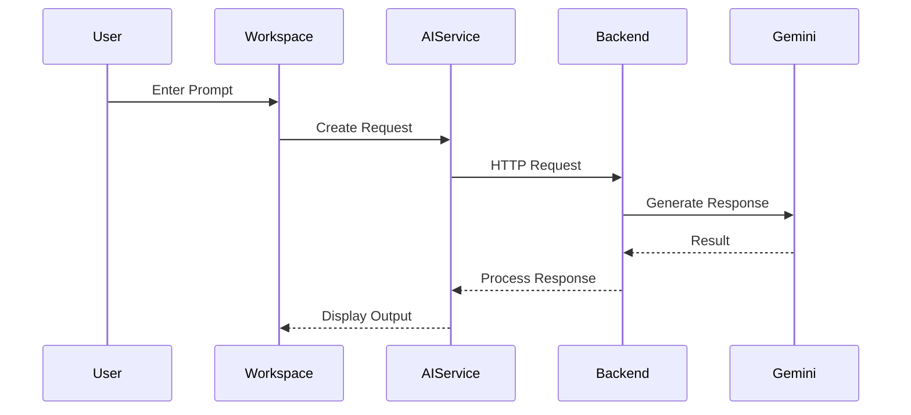
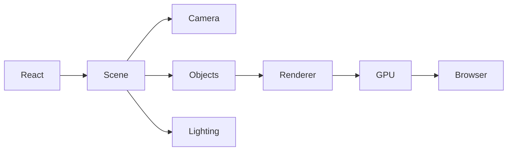

# FEATURES.md

> *This document explains the major modules that make up Solaris. Instead of listing interface elements, it describes the purpose behind each system, how the modules interact, and the engineering decisions that shaped their implementation. The goal is to provide enough context for developers to understand why each feature exists, how it contributes to the overall architecture, and where future development is headed.*

---

# Table of Contents

* Introduction
* Design Philosophy
* The Workspace
* Landing Experience
* Navigation System

---

# Introduction

Solaris was never intended to be a collection of disconnected features.

Every module exists because it contributes to a larger workflow. Conversations support projects. Projects generate research. Research influences implementation. Implementation creates new questions that eventually return to the AI workspace. Instead of forcing users to move between unrelated applications, Solaris attempts to keep those activities connected inside a single environment.

This philosophy affects much more than the user interface.

Individual modules are designed to solve one responsibility well while remaining independent from the rest of the application. The result is a workspace that can evolve gradually instead of requiring major rewrites whenever new functionality is introduced.

Although Solaris is still actively evolving, its internal organization already reflects this modular mindset. Features are expected to grow, merge, split, or even disappear over time without disrupting the surrounding architecture.

This document explains those modules individually and describes how they contribute to the broader application.

---

# Design Philosophy

Most software projects begin by asking what features should be built.

Solaris begins by asking how those features should work together.

That distinction influences nearly every engineering decision inside the project.

The objective is not to build the largest collection of AI tools. Instead, the focus is on creating an environment where different capabilities naturally complement one another. Every module should strengthen the workflow instead of competing for attention.

Several principles guide this process.

### Features Should Feel Connected

Opening the workspace should not feel like opening a folder full of unrelated utilities.

Each module should contribute to the same development experience. Navigation, AI conversations, visual components, animations, and interactive systems all exist within a shared design language so the application behaves like one product instead of several independent pages.

---

### Simplicity Wins

Adding another feature is easy.

Keeping twenty features understandable is considerably harder.

Whenever Solaris grows, the first question is whether the new functionality improves the overall workflow. If it introduces unnecessary complexity or duplicates existing behavior, it usually needs to be redesigned before becoming part of the project.

This mindset has prevented several experimental ideas from becoming permanent features before they were mature enough to justify their place.

---

### Learning Through Engineering

Solaris is also a learning project.

Many modules exist because they provided an opportunity to explore technologies that were unfamiliar at the time they were introduced.

Building an AI service required understanding backend communication.

Interactive graphics required learning Three.js and browser rendering.

Modern interfaces encouraged exploring React architecture, component composition, state management, animation systems, and responsive design.

Every completed module represents both a user-facing feature and a milestone in understanding a new area of software engineering.

---

# The Workspace

The workspace forms the center of Solaris.

Everything else in the application exists to support it.

Unlike conventional AI interfaces that revolve around a single conversation window, the workspace is designed to become an environment where multiple forms of work can coexist.

Research, conversations, projects, interactive experiences, and future development tools are intended to share the same space rather than competing across different browser tabs.

This approach reduces context switching and allows users to remain focused on the problem they are solving instead of the software they are using.

---

## Purpose

The workspace exists to provide continuity.

Traditional AI interactions often end when a conversation ends.

Software development rarely follows that pattern.

Ideas evolve over hours or days.

Research becomes documentation.

Documentation becomes implementation.

Implementation produces new questions.

The workspace is designed around that continuous cycle rather than isolated prompts.

---

## User Workflow

A typical interaction follows a simple pattern.

```text
User Opens Solaris
        │
        ▼
Selects or Creates a Workspace
        │
        ▼
Begins Research or Development
        │
        ▼
Uses AI Assistance
        │
        ▼
Refines Ideas
        │
        ▼
Continues Building
```

Although this appears straightforward, keeping the workflow uninterrupted requires coordination between navigation, interface state, backend communication, and reusable components.

Much of the surrounding architecture exists specifically to preserve that continuity.

---

## Implementation

From an engineering perspective, the workspace acts as the application's central container.

Rather than containing all functionality directly, it coordinates independent modules.

Examples include:

* Navigation
* Sidebar
* AI Workspace
* Interactive modules
* Future project tools
* Shared services

Each module remains responsible for its own behavior while the workspace manages how those pieces fit together.

This separation keeps complexity localized and allows new capabilities to be introduced without restructuring the entire application.

---

## Engineering Notes

One lesson became apparent early in development.

Large containers quickly become difficult to maintain.

Whenever new responsibilities accumulated inside the workspace, they were gradually extracted into dedicated components or services.

This process reduced coupling, improved readability, and made future expansion significantly easier.

The workspace continues evolving, but its responsibility remains intentionally narrow.

It coordinates.

It does not own every feature.

---

## Future Improvements

Future versions of the workspace may introduce:

* Persistent projects
* Context-aware sessions
* Workspace memory
* Multi-document layouts
* Dockable panels
* Plugin integration
* Developer dashboards

The existing architecture has been organized so these additions can extend the workspace instead of replacing it.

---

# Landing Experience

The landing page creates the first impression of Solaris.

Rather than functioning as a traditional homepage, it introduces the application's design language and establishes expectations for the rest of the experience.

Every element on the page exists for a reason.

Typography communicates hierarchy.

Animations guide attention.

Spacing improves readability.

Interactive elements encourage exploration without overwhelming new users.

The goal is to create confidence through clarity rather than visual excess.

---

## Purpose

The landing experience serves several roles simultaneously.

It introduces the project.

It explains the application's purpose.

It provides access to the workspace.

It demonstrates the visual language used throughout Solaris.

Accomplishing these objectives without creating a cluttered interface required careful balance between presentation and simplicity.

---

## User Journey

The landing experience is intentionally linear.

```text
Landing Page
      │
      ▼
Project Introduction
      │
      ▼
Primary Call to Action
      │
      ▼
Workspace
```

Reducing unnecessary decision points helps users understand the application before introducing more advanced functionality.

---

## Visual Design

The interface emphasizes clean layouts, generous spacing, restrained color usage, and subtle motion.

Instead of relying on visual complexity, Solaris attempts to create depth through consistency.

Animations remain lightweight.

Typography remains readable.

Navigation remains obvious.

The interface should support the workflow rather than compete with it.

---

## Engineering Notes

Although the landing page appears relatively simple, it establishes patterns that influence the rest of the application.

Component organization, animation timing, spacing systems, typography, and responsive behavior all originate here before extending into other modules.

For that reason, improvements to the landing experience often influence much more than the page itself.

---

# Navigation System

Every growing application eventually faces the same challenge.

As features increase, finding them becomes more difficult.

The navigation system exists to solve that problem while remaining as unobtrusive as possible.

Instead of demanding attention, navigation provides orientation.

Users should always understand where they are, how they arrived there, and how to move elsewhere without hesitation.

A predictable navigation structure becomes increasingly valuable as new modules are introduced because it prevents the interface from feeling fragmented.

---

## Design Objectives

The navigation system follows several guiding principles.

* Keep movement predictable.
* Reduce unnecessary clicks.
* Preserve workspace context.
* Avoid visual clutter.
* Support future expansion.

These objectives influence both the visual design and the internal organization of navigation components.

---

## Engineering Notes

Navigation components intentionally contain very little business logic.

Their responsibility is presenting structure rather than managing application behavior.

This separation allows routing, workspace management, and future plugin systems to evolve independently while the navigation layer remains relatively stable.

As Solaris expands, maintaining that separation will become increasingly valuable because navigation complexity tends to grow alongside application complexity.

---

---

# Sidebar

The sidebar is the primary navigation anchor within Solaris. At first glance it appears to be a simple collection of navigation controls, but its role extends much further than moving between pages.

As applications grow, navigation often becomes fragmented. New features introduce new entry points, temporary menus evolve into permanent interface elements, and users gradually lose a clear understanding of where they are inside the application.

The sidebar exists to prevent that.

Rather than competing for attention, it provides a stable frame of reference that remains consistent regardless of which workspace module is currently active. Whether a user is interacting with AI, exploring visual modules, or experimenting with future features, navigation behaves predictably.

That consistency reduces cognitive load because users spend less time searching for functionality and more time working.

---

## Purpose

The sidebar serves several responsibilities simultaneously.

It provides access to major application modules.

It communicates the overall structure of the workspace.

It maintains orientation during navigation.

It creates a consistent interaction pattern across the application.

These responsibilities remain intentionally separate from application logic. The sidebar does not manage business rules, communicate with backend services, or coordinate AI interactions. Its responsibility is navigation, nothing more.

Keeping that boundary clear has made the component considerably easier to maintain as Solaris has expanded.

---

## User Workflow

Navigation is intentionally direct.

```text
Workspace
    │
    ▼
Sidebar
    │
    ├── AI Workspace
    ├── Interactive Modules
    ├── Projects
    ├── Experiments
    └── Settings
```

The hierarchy remains intentionally shallow.

Users should rarely need to navigate through multiple nested menus before reaching their destination. As additional modules are introduced, maintaining that simplicity becomes increasingly important.

---

## Component Design

The sidebar is composed from smaller reusable interface elements rather than one large navigation component.

Each element performs a specific responsibility.

Navigation items display available destinations.

Visual indicators communicate the active section.

Interaction handlers respond to user input.

Layout containers organize spacing and alignment.

By separating these concerns, individual parts of the sidebar can evolve independently without affecting unrelated behavior.

---

## Engineering Notes

Earlier iterations of Solaris relied on more tightly coupled navigation components.

As new features appeared, maintaining those implementations became increasingly difficult because navigation logic, visual presentation, and workspace behavior gradually became intertwined.

Separating responsibilities reduced this complexity considerably.

Navigation now remains largely independent from the rest of the application, making future expansion significantly easier.

---

## Future Improvements

Several enhancements are planned as Solaris continues to evolve.

Potential additions include:

* Workspace switching
* Recently opened projects
* Favorites
* Plugin shortcuts
* Context-sensitive navigation
* Collapsible module groups
* Search-based navigation

The current implementation provides a foundation for these additions without requiring major architectural changes.

---

# Workspace Layout

The workspace layout defines how individual modules occupy the available screen space.

Unlike a collection of independent pages, Solaris attempts to present every feature as part of a shared working environment. The layout is responsible for maintaining that consistency.

Each module occupies a predictable location within the interface. Navigation remains stable while content areas adapt according to the active workflow.

This separation creates a stronger sense of continuity because users interact with changing content inside a familiar environment rather than constantly transitioning between unrelated layouts.

---

## Layout Philosophy

Layouts should support work rather than attract attention.

For that reason, Solaris avoids unnecessary visual complexity.

Whitespace is used deliberately.

Information is grouped logically.

Frequently accessed controls remain accessible.

Secondary information appears only when needed.

Every layout decision attempts to reduce unnecessary movement while preserving flexibility for future modules.

---

## Responsive Structure

Different devices provide different amounts of available space.

Instead of maintaining separate applications for desktop and mobile environments, Solaris adapts its existing layout according to screen size.

Major interface regions reorganize naturally while preserving familiar interaction patterns.

Navigation remains recognizable.

Content remains readable.

Controls remain accessible.

The objective is consistency rather than identical appearance.

---

## Layout Flow

```text
┌──────────────────────────────────────────┐
│                Navigation                │
├───────────────┬──────────────────────────┤
│               │                          │
│    Sidebar    │     Active Workspace     │
│               │                          │
│               │                          │
├───────────────┴──────────────────────────┤
│          Shared Status / Footer          │
└──────────────────────────────────────────┘
```

Although individual modules vary considerably, the surrounding layout remains predictable.

This consistency helps users build familiarity with the application as new functionality is introduced.

---

## Engineering Notes

One recurring challenge during development involved balancing flexibility with consistency.

Highly specialized layouts often improved one module while making others more difficult to integrate.

The current approach favors reusable layout containers that can accommodate different types of content without requiring each module to invent its own structural system.

This decision has simplified maintenance while making future interface expansion considerably easier.

---

# Responsive Design

Responsive design is treated as an architectural requirement rather than a finishing step.

Many applications achieve responsiveness by rearranging interface elements after desktop development is complete.

Solaris instead attempts to build responsive behavior into components from the beginning.

Each module should remain functional regardless of the available screen size.

This philosophy influences spacing, typography, navigation behavior, interaction targets, and component composition throughout the application.

---

## Design Goals

Responsive behavior aims to preserve usability rather than duplicate desktop layouts.

The primary goals include:

* Readable typography
* Comfortable interaction spacing
* Flexible layouts
* Consistent navigation
* Predictable behavior

Users should feel they are using the same application regardless of device.

---

## Adaptive Components

Individual components are expected to adapt naturally.

Large panels reorganize.

Navigation compresses.

Spacing adjusts.

Content reflows.

These changes occur without fundamentally altering how the application behaves.

Reducing conceptual differences between devices lowers the learning curve and simplifies long-term maintenance.

---

## Engineering Notes

Building responsiveness into reusable components proved considerably easier than retrofitting existing layouts later.

That experience reinforced one of Solaris' recurring architectural themes.

Designing for change usually produces cleaner software than adapting to change after complexity has already accumulated.

---

# Animation System

Motion plays an important role throughout Solaris, but its purpose extends beyond visual appeal.

Animations communicate state changes.

They explain transitions.

They reduce abrupt interface changes.

They provide feedback after user interactions.

Good animation often goes unnoticed because it feels natural.

Poor animation draws attention to itself.

Solaris attempts to achieve the former.

---

## Motion Philosophy

Animations should improve understanding.

If motion delays interaction or distracts from the current task, it has failed regardless of how visually impressive it appears.

Every transition therefore serves one of several purposes.

* Communicating hierarchy.
* Confirming interaction.
* Guiding attention.
* Preserving orientation.
* Creating continuity.

Motion exists to support usability.

---

## Technical Approach

Animation logic remains isolated from business logic.

This separation provides several advantages.

Visual timing can evolve without affecting application behavior.

Interaction logic remains easier to understand.

Animation systems become reusable across multiple modules.

As Solaris expands, this separation reduces maintenance effort while encouraging visual consistency.

---

## Performance Considerations

Smooth animation depends as much on architectural decisions as visual design.

Keeping components lightweight, reducing unnecessary rendering, and limiting expensive layout recalculations contribute significantly more than adding increasingly complex animation libraries.

For that reason, animation performance is considered during implementation rather than after visual design has been completed.

---

# Design Language

A consistent interface requires more than matching colors.

Solaris attempts to establish a visual language that users gradually learn through repeated interaction.

Spacing communicates hierarchy.

Typography establishes emphasis.

Color indicates meaning.

Icons reinforce recognition.

Motion explains change.

When these elements behave consistently, users spend less effort interpreting the interface and more effort completing their work.

Rather than relying on decorative styling, Solaris emphasizes clarity, predictability, and restraint.

As new modules are introduced, they inherit this design language instead of defining entirely new interaction patterns.

---

# Engineering Observations

Several broader patterns emerged while building the systems described in this section.

Navigation became easier after separating presentation from application logic.

Layouts became more maintainable once reusable containers replaced specialized implementations.

Responsive behavior improved when considered during component design instead of after interface completion.

Animations became simpler to maintain after visual behavior was isolated from business logic.

These changes did not appear because a single architectural decision solved every problem.

They emerged gradually through repeated refactoring and a better understanding of how individual modules interacted with one another.

That process continues to shape Solaris today.

---
---

# AI Workspace

The AI Workspace is the core environment of Solaris. While many AI applications revolve around a single conversation window, Solaris approaches interaction as part of a broader development workflow. The AI is treated as one component within a larger engineering environment rather than the entire product.

Every conversation begins inside a workspace that is designed to encourage iteration. Questions lead to research, research leads to implementation, implementation raises new questions, and the cycle continues without forcing the user to leave the application.

This design shifts the focus from isolated prompts toward continuous problem solving.

---

## Purpose

The AI Workspace exists to reduce friction between thinking and building.

Instead of opening multiple browser tabs, copying information between applications, and repeatedly switching context, users remain inside a single interface where conversations naturally support ongoing work.

The workspace is intended to become an environment where discussions, experiments, documentation, and development can coexist.

---

## User Workflow

Most interactions follow a predictable flow.

```text
Open Workspace
      │
      ▼
Enter Prompt
      │
      ▼
Request Processing
      │
      ▼
AI Response
      │
      ▼
Continue Discussion
      │
      ▼
Refine or Expand Ideas
```

Although the workflow appears simple, maintaining smooth interaction requires coordination between frontend state, backend services, API communication, rendering, and reusable components.

---

## Component Structure

The AI Workspace is intentionally divided into smaller responsibilities.

```text
AI Workspace
│
├── Conversation View
├── Prompt Input
├── Response Renderer
├── Message History
├── Loading States
├── Error Handling
└── AI Service
```

Each section performs one responsibility. This separation makes debugging easier while allowing new functionality to be introduced without restructuring the entire interface.

---

## Engineering Notes

Early versions mixed rendering logic with request handling inside the same components.

As the project expanded, those responsibilities became difficult to maintain.

Communication with external services gradually moved into reusable service modules while interface components focused primarily on presentation and interaction.

This reduced duplication and simplified future development.

---

# Conversation Engine

At the heart of the workspace is the conversation engine.

Its responsibility is managing the interaction between users and the underlying language model while keeping the interface responsive and predictable.

Rather than treating every message as an isolated event, the engine coordinates the complete conversation lifecycle.

That includes:

* Accepting user input
* Managing request state
* Displaying loading feedback
* Receiving responses
* Rendering formatted output
* Recovering from failures

Keeping this process centralized creates a more consistent experience across the application.

---

## Request Lifecycle



Every interaction follows this same structure regardless of the prompt itself.

The consistency makes future providers easier to integrate because only the service layer needs to change.

---

# Backend Integration

The frontend never communicates directly with the AI provider.

Instead, requests travel through an Express backend that acts as a secure communication layer.

This architectural boundary provides several advantages.

API keys remain protected.

Provider-specific logic stays outside the frontend.

Request validation occurs before external communication.

Future AI providers can be introduced without changing the user interface.

Separating these responsibilities makes the overall system easier to maintain as new functionality is added.

---

## Communication Flow

```text
User
 │
 ▼
React Components
 │
 ▼
AI Service
 │
 ▼
Express Backend
 │
 ▼
Gemini API
 │
 ▼
Processed Response
 │
 ▼
User Interface
```

Each layer performs one specific task.

No component needs to understand every stage of the request lifecycle.

---

# Prompt Processing

Prompt processing extends beyond sending text to an API.

Every interaction moves through several stages before reaching the language model.

Input is validated.

Application state updates.

Loading indicators become active.

The request is prepared.

The backend performs communication.

Responses are normalized before returning to the interface.

This sequence keeps the user informed while maintaining a consistent interaction pattern.

---

# Response Rendering

Rendering AI output is more complex than displaying plain text.

Responses often contain multiple content types.

Examples include:

* Code blocks
* Lists
* Tables
* Markdown
* Technical explanations
* Multi-paragraph discussions

The rendering system is designed to present each format clearly while remaining visually consistent with the rest of the application.

Future improvements may include richer markdown support, syntax highlighting, diagrams, and interactive content.

---

# Interactive Graphics

Solaris extends beyond traditional user interfaces by incorporating interactive visual experiences.

These modules are intended to make the application feel dynamic without overwhelming the user.

Rather than existing purely for decoration, graphics reinforce the project's technical identity while providing opportunities to explore browser rendering, animation systems, and real-time interaction.

---

# Three.js Experiences

Three.js introduces an entirely different rendering model compared to conventional React components.

Instead of manipulating HTML elements, the application manages scenes, cameras, lighting, geometry, and rendering loops.

This required learning concepts that differ significantly from standard frontend development.

A simplified graphics pipeline appears below.



React coordinates the experience.

Three.js manages rendering.

The browser displays the final result.

Keeping these responsibilities separate simplifies both systems.

---

## Engineering Challenges

Integrating Three.js introduced several technical challenges.

Graphics rendering follows a continuous update cycle rather than React's event-driven rendering model.

Managing those differences required careful separation between application state and rendering logic.

Interactive scenes also demanded attention to performance.

Complex geometry, unnecessary updates, or excessive rendering could quickly reduce responsiveness.

These experiences significantly expanded the project's technical scope beyond conventional web development.

---

# Experimental Modules

One defining characteristic of Solaris is its willingness to experiment.

Not every module begins as a polished feature.

Some exist primarily to explore unfamiliar technologies before determining whether they belong in the long-term architecture.

This experimental approach has led to a deeper understanding of frontend engineering, rendering systems, backend communication, and interface design.

Successful ideas gradually mature into stable modules.

Others remain prototypes or are removed entirely.

Allowing experimentation without destabilizing the rest of the application is one reason the project emphasizes modular architecture.

---

# Performance Characteristics

Interactive systems introduce additional performance considerations beyond traditional interfaces.

Several architectural decisions help maintain responsiveness.

Components remain relatively small.

Rendering responsibilities are isolated.

Graphics systems operate independently from business logic.

Reusable services reduce duplicated work.

The backend centralizes provider communication.

Together these choices contribute to an interface that remains responsive while supporting increasingly sophisticated functionality.

---

# Engineering Challenges

Developing the AI Workspace revealed challenges that extended beyond implementation.

Balancing flexibility with simplicity required repeated iteration.

Introducing new features often exposed opportunities to simplify existing architecture rather than expand it.

Managing AI communication, rendering interactive graphics, maintaining responsive layouts, and organizing reusable components all required different engineering approaches.

Perhaps the most valuable lesson was recognizing when to refactor instead of continuing to build on increasingly complex foundations.

That mindset continues to shape Solaris as the project evolves.

---

# Future Direction

The AI Workspace is intended to become considerably more capable over time.

Planned areas of exploration include:

* Persistent conversation memory
* Multi-model support
* Context-aware project assistance
* Integrated documentation
* Local AI execution
* Collaborative workspaces
* Knowledge organization
* Advanced developer tools

The current architecture has been designed to support these additions without requiring fundamental changes to the existing system.

Each new capability should extend the workspace while preserving the modular principles established throughout the project.

---

---

# Project Structure

As Solaris has expanded, maintaining a clear repository structure has become just as important as adding new features. A well-organized project allows contributors to understand the system without reading every source file, reduces the likelihood of duplicated logic, and makes refactoring considerably less disruptive.

The repository is organized around responsibilities rather than file types. Components remain close to related functionality, shared services are isolated from presentation logic, and reusable utilities are collected in dedicated modules. This approach keeps the project approachable even as the number of files continues to grow.

A simplified representation of the repository appears below.

```text
src
│
├── components
├── pages
├── services
├── hooks
├── providers
├── animations
├── assets
├── styles
├── utils
├── types
└── App.tsx
```

Every directory exists for a specific reason. Components focus on user interaction, services manage application behavior, utilities provide shared functionality, and providers coordinate state across multiple modules. This separation reduces coupling while encouraging reuse.

---

# Services

The service layer forms the bridge between the user interface and the backend. Rather than allowing individual React components to communicate directly with external systems, shared application behavior is centralized into reusable services.

Typical responsibilities include:

* AI request management
* Backend communication
* Response formatting
* Shared business logic
* Future storage mechanisms
* Configuration handling

Centralizing these operations makes the application easier to maintain. If an external API changes, the modification usually affects one service instead of dozens of interface components.

---

# Utilities

Utility functions solve small problems that appear repeatedly throughout the application.

Examples include:

* Data formatting
* String manipulation
* Validation
* Helper functions
* Shared calculations
* Common constants

Keeping these helpers separate avoids duplicated implementations and allows the rest of the codebase to remain focused on higher-level responsibilities.

Utilities should remain simple and predictable. Whenever a helper begins accumulating application-specific logic, it is usually promoted into a dedicated service instead.

---

# Performance Features

Performance is considered throughout development rather than treated as a final optimization step.

Several architectural choices contribute to the responsiveness of Solaris.

### Component Isolation

Smaller components reduce unnecessary rendering and simplify maintenance.

### Service Abstraction

Shared services prevent duplicated work and centralize communication with external systems.

### Responsive Rendering

Interface updates are localized whenever possible, allowing React to minimize unnecessary DOM updates.

### Efficient Graphics

Interactive scenes are isolated from the rest of the interface so rendering-intensive modules do not interfere with unrelated components.

### Build Optimization

Vite provides fast development builds and optimized production output while keeping the development experience lightweight.

These improvements combine to produce a responsive interface without introducing excessive architectural complexity.

---

# Accessibility

Accessibility is an ongoing area of development.

Solaris aims to remain usable across a wide variety of devices and interaction methods.

Current design principles include:

* Clear visual hierarchy
* Consistent navigation
* Readable typography
* Sufficient spacing
* Responsive layouts
* Predictable interaction patterns

Future development will continue improving keyboard navigation, semantic markup, screen reader compatibility, and overall usability.

Accessibility is not treated as a separate feature. It influences every interface decision.

---

# Security

Although Solaris is currently a personal engineering project, several architectural decisions already reflect production-oriented security practices.

Sensitive API keys remain outside the frontend.

Communication with external AI providers occurs through the backend.

Environment variables isolate confidential configuration from application code.

Future authentication systems can integrate naturally because the backend already serves as the application's communication boundary.

Security grows alongside the application rather than being introduced after development has finished.

---

# Developer Experience

Writing software is only part of maintaining a project.

The experience of working inside the repository matters just as much.

Solaris emphasizes:

* Consistent file organization
* Predictable naming conventions
* Modular architecture
* Readable code
* Reusable abstractions
* Clear documentation

These practices reduce onboarding time for future contributors while making long-term maintenance significantly easier.

---

# Configuration

Configuration is intentionally separated from application logic wherever possible.

Examples include:

* Environment variables
* API endpoints
* Build configuration
* TypeScript settings
* Development tooling

Keeping configuration isolated reduces the likelihood of introducing accidental bugs while simplifying deployment across different environments.

---

# Feature Maturity

Not every module within Solaris is at the same stage of development.

Some systems have undergone multiple rounds of refinement, while others remain active experiments intended to explore new ideas before becoming permanent parts of the project.

| Module               | Status       | Notes                                                    |
| -------------------- | ------------ | -------------------------------------------------------- |
| Landing Experience   | Stable       | Primary entry point into the application.                |
| Workspace            | Stable       | Core environment where features are organized.           |
| Navigation           | Stable       | Provides consistent movement between modules.            |
| Sidebar              | Stable       | Central navigation layer.                                |
| AI Workspace         | Stable       | Primary interaction system for AI-assisted workflows.    |
| Backend Integration  | Stable       | Handles secure communication with external AI providers. |
| Three.js Experiences | Experimental | Interactive rendering and visual experiments.            |
| Interactive Graphics | Experimental | Ongoing exploration of browser-based graphics.           |
| Future Plugin System | Planned      | Designed for long-term extensibility.                    |
| Local AI Integration | Planned      | Future objective for offline and hybrid workflows.       |

This classification reflects the current state of development and will continue evolving as Solaris matures.

---

# Roadmap

Solaris continues to evolve through incremental improvements rather than large rewrites.

Current areas of exploration include:

### Short-Term

* Improved conversation management
* Better documentation
* Additional UI refinements
* Enhanced responsive layouts
* Expanded animation system

### Mid-Term

* Persistent workspaces
* Rich markdown rendering
* Improved project organization
* Enhanced Three.js modules
* Performance profiling

### Long-Term

* Plugin architecture
* Local AI execution
* Multi-provider AI support
* Collaborative workspaces
* Embedded development tools
* Integrated documentation system
* Project memory
* Advanced engineering dashboard

Rather than treating these objectives as fixed milestones, the roadmap serves as a direction for continued experimentation and learning.

---

# Lessons Learned

Solaris has been as much an engineering exercise as a software project.

Building the application introduced challenges across frontend architecture, backend communication, API integration, graphics programming, animation systems, and user interface design.

One recurring lesson emerged throughout development.

The first implementation is rarely the final implementation.

Features improved most after stepping back, identifying unnecessary complexity, and reorganizing the architecture around clearer responsibilities.

Refactoring became a regular part of development rather than something reserved for major releases.

Another important realization was the value of modular design. As the number of features increased, maintaining clear boundaries between components, services, and backend communication became increasingly important. The more predictable the architecture became, the easier it was to introduce new ideas without destabilizing existing functionality.

Perhaps the most valuable lesson was understanding that software engineering extends far beyond writing code. Planning, documentation, architecture, testing, debugging, and continuous refinement all contribute just as much to the quality of a project as the implementation itself.

---

# About This Project

Solaris represents an ongoing effort to explore modern software engineering through practical development.

The project combines frontend architecture, backend services, AI integration, responsive design, interactive graphics, and modular application structure within a single codebase. While many systems are already functional, the project continues to evolve as new technologies are explored and existing implementations are refined.

Development has included the responsible use of AI tools to accelerate research, generate ideas, explain unfamiliar concepts, and assist with repetitive implementation tasks. Those tools supported the development process rather than replacing it. The system architecture, feature planning, integration work, debugging, customization, testing, documentation, and iterative refinement were driven through hands-on engineering decisions and continuous experimentation.

Solaris should therefore be viewed as both a functional application and a record of learning. Each module reflects a stage in understanding modern web development, backend engineering, artificial intelligence, and software architecture.

The project will continue changing as new ideas emerge, but its guiding principles remain consistent: build thoughtfully, document thoroughly, refactor when necessary, and design systems that can grow without losing clarity.

---

# Closing Thoughts

Good software is rarely defined by the number of features it contains. It is defined by how well those features work together.

Throughout Solaris, the focus has been on creating clear architectural boundaries, maintaining a consistent user experience, and building a foundation that supports future experimentation. Every new module is evaluated not only by what it adds, but also by how it fits within the larger system.

The project remains a work in progress, and that is intentional. Continuous learning, iterative refinement, and thoughtful engineering are central to its development. As Solaris evolves, the architecture, documentation, and implementation will continue improving alongside it.

The repository reflects more than a finished application. It represents the process of learning how to design, build, and refine increasingly complex software systems.

---
