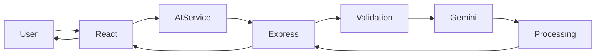
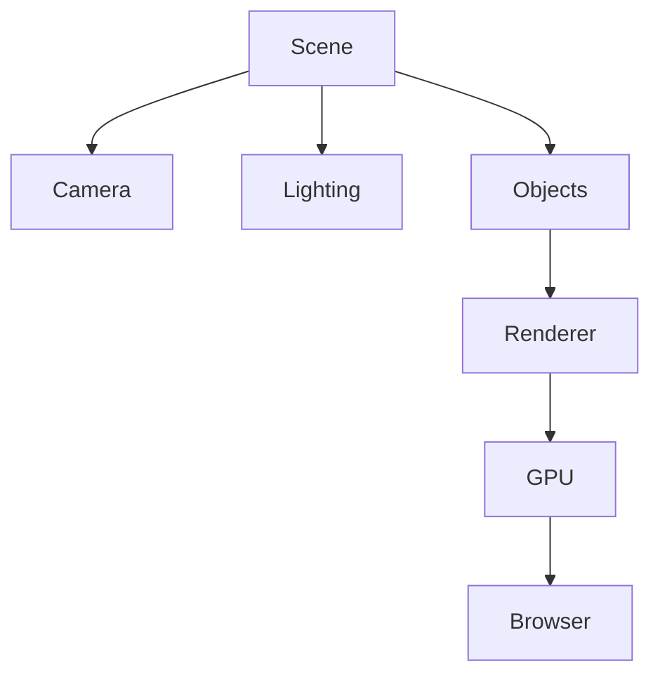
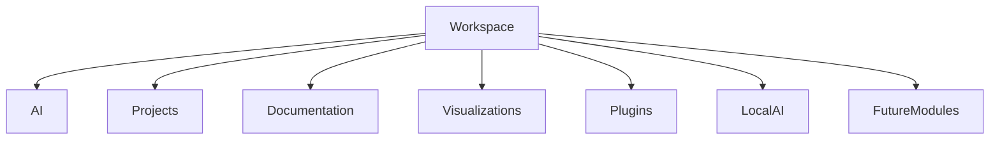

# PERFORMANCE.md

> *Performance is not treated as a final optimization step in Solaris. It influences architectural decisions from the beginning of development, affecting component design, state management, rendering behavior, networking, and user interaction. This document explains the engineering choices that contribute to the responsiveness of the application, the trade-offs behind those decisions, and the areas that remain under active development.*

---

# Table of Contents

* Performance Philosophy
* Why Performance Matters
* Performance Budget
* Frontend Performance
* React Rendering Strategy
* Component Architecture
* State Management
* Engineering Observations

---

# Performance Philosophy

Performance is often associated with loading times, animation smoothness, or benchmark scores. Those measurements are useful, but they only describe the visible outcome of much larger architectural decisions.

In Solaris, performance begins long before the application is compiled.

It starts with how responsibilities are divided between components, how frequently state changes propagate through the interface, how rendering work is distributed, and how much unnecessary computation is avoided during normal interaction.

The objective is not to build the fastest possible application in synthetic benchmarks. The objective is to create an interface that feels responsive, predictable, and consistent while remaining maintainable as the project grows.

Every optimization introduces trade-offs.

Aggressive caching can increase memory usage.

Complex memoization may reduce readability.

Premature optimization often creates unnecessary abstraction.

Solaris attempts to balance these competing concerns rather than optimizing individual metrics in isolation.

---

# Why Performance Matters

Modern web applications rarely struggle because processors are too slow.

Most performance problems arise from software architecture.

Repeated rendering.

Duplicated state.

Large component trees.

Excessive network requests.

Poor separation of responsibilities.

As additional features are introduced, these issues compound quickly.

Because Solaris combines artificial intelligence, interactive graphics, responsive layouts, and modular user interfaces, maintaining consistent responsiveness becomes increasingly important.

The user should not notice how many independent systems cooperate behind the scenes.

Interactions should remain immediate.

Animations should remain smooth.

Navigation should feel predictable.

Performance therefore becomes part of the user experience rather than a purely technical concern.

---

# Performance Budget

Every application operates within practical resource limits.

Although Solaris is not constrained by extremely low-powered hardware, unnecessary computation still affects responsiveness, battery life, and browser stability.

Development therefore follows an informal performance budget.

Several principles guide implementation.

* Avoid unnecessary rendering.
* Keep components focused on one responsibility.
* Minimize duplicated work.
* Reduce avoidable network communication.
* Prefer composition over deeply nested logic.
* Load expensive systems only when required.
* Separate visual effects from application logic.
* Keep third-party dependencies intentional.

These guidelines influence implementation decisions throughout the project.

---

# Frontend Performance

The frontend is responsible for nearly every interaction users experience.

Rendering updates.

Navigation.

Animations.

Input handling.

Layout adjustments.

AI conversations.

Visual feedback.

Even small inefficiencies become noticeable because these systems operate continuously.

Solaris approaches frontend performance by reducing unnecessary work rather than attempting to accelerate inefficient designs.

Instead of relying exclusively on optimization techniques after implementation, many architectural choices attempt to avoid performance problems before they appear.

---

## Rendering Philosophy

React performs exceptionally well when components remain predictable.

Large components that manage many unrelated responsibilities often become more expensive to maintain than the rendering work itself.

Solaris therefore favors smaller, reusable components with clearly defined purposes.

A navigation component manages navigation.

A conversation component manages conversations.

Animation systems remain isolated from application logic.

Backend communication occurs through dedicated services.

This separation naturally reduces rendering complexity while improving maintainability.

---

## Responsive Updates

Not every user interaction requires the entire interface to update.

Whenever possible, state changes remain localized.

For example:

* Typing inside an input field should not trigger unrelated interface updates.
* Navigation changes should not re-render static content unnecessarily.
* AI loading indicators should update independently from the rest of the workspace.
* Interactive graphics should remain isolated from ordinary UI rendering.

Reducing the scope of updates allows React to perform less work while keeping interactions smooth.

---

# React Rendering Strategy

React's rendering model encourages declarative interfaces, but that does not eliminate the need for thoughtful component design.

Rendering itself is rarely the bottleneck.

Unnecessary rendering is.

Throughout Solaris, the goal is to ensure components render because they need to—not because unrelated parts of the application changed.

---

## Component Independence

Each major interface region is designed to operate as independently as practical.

```text id="m8p2fw"
Application
│
├── Navigation
├── Sidebar
├── Workspace
│     ├── AI Interface
│     ├── Interactive Modules
│     └── Future Features
├── Footer
└── Shared Providers
```

Changes within one section should have minimal impact on the others.

Maintaining this independence reduces rendering overhead while making debugging significantly easier.

---

## Predictable Data Flow

Predictable rendering depends on predictable data flow.

State moves downward through clearly defined interfaces.

Components communicate through explicit properties rather than hidden dependencies.

Business logic remains separate from presentation whenever practical.

This structure simplifies reasoning about updates while reducing the likelihood of accidental rendering cascades.

---

## Future Optimization Opportunities

Several React optimization techniques remain under consideration as Solaris grows.

These include:

* Component memoization
* Lazy loading
* Route-based code splitting
* Suspense boundaries
* Selective hydration for future server-rendered deployments
* Virtualized rendering for large datasets

These techniques will be introduced only where measurable benefits justify the additional complexity.

---

# Component Architecture

Component organization has a significant influence on performance.

Large monolithic components often accumulate responsibilities that extend far beyond presentation.

They manage state.

They perform calculations.

They communicate with services.

They coordinate animations.

Over time, this complexity increases rendering cost while making maintenance more difficult.

Solaris instead favors composition.

Small components combine to create larger systems without requiring every module to understand the complete application.

---

## Layered Responsibility

A simplified hierarchy appears below.

```text id="n2kx7h"
Page

↓

Layout

↓

Feature Module

↓

Reusable Component

↓

Primitive UI Element
```

Each layer performs a distinct responsibility.

Higher layers coordinate behavior.

Lower layers focus on presentation.

This separation naturally limits the amount of work each component performs during updates.

---

## Reusability

Reusable components improve more than development speed.

They also improve consistency.

Optimizations applied to one component automatically benefit every location where that component is used.

Likewise, bug fixes propagate naturally without requiring duplicated implementations.

This approach keeps the interface both faster and easier to evolve.

---

# State Management

State management often determines how efficiently a React application scales.

Poorly organized state frequently leads to unnecessary rendering, duplicated information, and increasingly difficult debugging.

Solaris attempts to keep state as localized as practical.

Local component state remains inside individual features whenever possible.

Shared state is elevated only when multiple modules genuinely depend on the same information.

This strategy reduces communication overhead while preserving predictable rendering behavior.

---

## State Categories

The application broadly distinguishes between several types of state.

### Local State

Temporary interaction data.

Examples include:

* Input fields
* Menu visibility
* Loading indicators
* Selected tabs

---

### Shared State

Information required by multiple modules.

Examples include:

* Active workspace
* User preferences
* Authentication state
* Theme configuration

---

### Server State

Data originating from backend services.

Examples include:

* AI responses
* Future project information
* User-specific resources
* Configuration retrieved from APIs

Separating these categories simplifies reasoning about application behavior while reducing unnecessary updates.

---

# Engineering Observations

Several performance-related patterns emerged repeatedly during development.

Smaller components consistently proved easier to optimize than larger ones.

Keeping services independent reduced duplicated work.

Separating rendering from business logic simplified debugging.

Localizing state reduced unnecessary interface updates.

Perhaps the most valuable lesson was recognizing that architecture has a greater influence on long-term performance than isolated optimization techniques.

Well-structured software tends to remain responsive because it performs only the work that is necessary.

Poorly structured software often requires increasingly complex optimizations simply to maintain acceptable performance.

For Solaris, the emphasis therefore remains on building clear systems first and optimizing measurable bottlenecks when they genuinely appear.

---

---

# Backend Performance

Although users interact only with the frontend, much of Solaris' perceived responsiveness depends on what happens after a request leaves the browser.

The backend is intentionally lightweight.

Its primary responsibility is coordinating communication between the application and external AI providers while keeping processing overhead to a minimum. Rather than performing heavy computation itself, it validates requests, forwards them to the appropriate service, processes returned responses, and delivers consistent data back to the frontend.

Keeping the backend focused prevents unnecessary latency while making future scaling significantly easier.

---

## Architectural Principles

Several design decisions influence backend performance.

The backend should remain stateless whenever practical.

Long-running computations should be delegated to specialized services rather than blocking incoming requests.

Provider-specific logic should remain isolated from the rest of the application.

Every request should follow a predictable lifecycle.

These principles reduce complexity while making behavior easier to measure and optimize.

---

## Request Lifecycle

Every AI interaction follows approximately the same sequence.



Because every request passes through the same pipeline, improvements made to one stage naturally benefit the rest of the application.

---

# AI Request Optimization

Artificial intelligence introduces a very different performance profile compared to traditional web applications.

The largest delay rarely comes from JavaScript execution.

Instead, most waiting time occurs while the language model generates a response.

This means optimization efforts focus less on raw computation and more on reducing unnecessary waiting throughout the request lifecycle.

Several techniques contribute to this approach.

---

## Immediate Feedback

Users should receive confirmation immediately after submitting a prompt.

Loading indicators appear before the request reaches the backend.

Input controls update instantly.

Conversation history reflects pending requests without waiting for the provider.

Although these actions do not reduce actual response time, they improve perceived responsiveness considerably.

---

## Request Validation

Rejecting invalid requests before contacting the provider reduces unnecessary API usage.

Examples include:

* Empty prompts
* Invalid request structures
* Unsupported operations
* Future rate-limited requests

Performing these checks locally avoids unnecessary network communication while improving reliability.

---

## Provider Isolation

The frontend never communicates directly with Gemini.

Instead, every request passes through a shared AI service and backend gateway.

This architecture introduces a small amount of processing overhead but significantly simplifies future optimization because improvements occur within one centralized location rather than multiple interface components.

---

# Network Communication

Network latency is unavoidable when communicating with cloud-based language models.

The surrounding architecture therefore attempts to minimize unnecessary communication rather than attempting to eliminate latency entirely.

Several principles guide network usage.

Only required information should be transmitted.

Responses should be normalized before returning to the interface.

Repeated requests should be avoided whenever practical.

Future caching mechanisms should operate transparently without affecting user interaction.

---

## Communication Layers

```text
Browser
   │
   ▼
Frontend Service
   │
   ▼
Express Backend
   │
   ▼
External AI Provider
   │
   ▼
Backend Processing
   │
   ▼
Frontend Rendering
```

Each layer performs a clearly defined responsibility before forwarding the request to the next stage.

---

## Future Improvements

Network performance could improve through several planned enhancements.

* Response streaming
* Intelligent caching
* Request batching
* Compression
* HTTP keep-alive optimization
* Provider selection based on latency
* Background context retrieval

The architecture already supports these additions without requiring major structural changes.

---

# Asset Optimization

Every web application depends on more than JavaScript.

Images, fonts, icons, stylesheets, and graphical assets all contribute to loading performance.

Solaris attempts to keep these resources intentional.

Only assets that directly improve the user experience are included.

Decorative resources are evaluated carefully because every additional file contributes to loading time.

---

## Image Strategy

Large images can significantly increase loading time.

Future versions of Solaris are expected to adopt several optimization techniques.

* Responsive image sizes
* Modern formats
* Lazy loading
* Deferred loading for secondary content

These approaches reduce bandwidth usage while preserving visual quality.

---

## Font Loading

Typography plays an important role throughout the interface.

However, excessive font loading introduces unnecessary delays.

Solaris therefore favors a limited number of carefully selected fonts instead of loading large font collections.

This reduces both download size and rendering complexity.

---

# Three.js Rendering

Interactive graphics represent one of the most computationally demanding systems inside Solaris.

Unlike traditional React components, Three.js continuously updates a rendered scene, often dozens of times every second.

This introduces an entirely different performance model.

Rendering efficiency depends on both CPU and GPU resources rather than DOM manipulation alone.

---

## Rendering Pipeline



Every rendered frame follows this pipeline.

Reducing unnecessary work at any stage contributes directly to smoother interaction.

---

## Scene Management

Performance depends heavily on how scenes are organized.

Large numbers of objects increase rendering cost.

Complex materials require additional GPU resources.

High-resolution textures consume memory.

Expensive lighting calculations reduce frame rate.

Solaris attempts to balance visual quality with rendering efficiency rather than maximizing graphical complexity.

---

## Future Rendering Improvements

Several rendering optimizations remain under consideration.

* Level-of-detail systems
* Texture compression
* Instanced rendering
* Frustum culling
* Dynamic resolution scaling
* Adaptive rendering quality

These techniques become increasingly valuable as interactive scenes become more sophisticated.

---

# Animation Performance

Animations influence perceived quality more than many users realize.

Smooth transitions communicate responsiveness.

Poorly optimized animations create the impression that the application itself is slow.

Solaris treats animation as part of the interaction system rather than decorative styling.

---

## Motion Principles

Animations should satisfy three conditions.

They should communicate information.

They should remain responsive.

They should never delay interaction.

Whenever an animation begins interfering with usability, it is reconsidered regardless of how visually appealing it appears.

---

## Rendering Efficiency

Animations rely primarily on browser-optimized properties whenever practical.

Reducing expensive layout recalculations allows transitions to remain smooth across a wider range of devices.

Animation timing also remains intentionally restrained.

Long animations rarely improve usability.

Short, consistent transitions generally produce a better experience.

---

# Build Optimization

Application performance extends beyond runtime behavior.

Build configuration influences initial loading speed, caching efficiency, and deployment size.

Solaris currently benefits from modern tooling that emphasizes fast development while producing optimized production builds.

Areas of optimization include:

* Efficient module bundling
* Dead code elimination
* Dependency optimization
* Static asset processing
* Minification
* Source map separation for production

As the application grows, bundle analysis will become increasingly important to prevent unnecessary increases in download size.

---

# Runtime Efficiency

A responsive application depends on continuous efficiency after it has loaded.

Several architectural patterns contribute to runtime performance.

Components remain relatively small.

Services isolate business logic.

State changes remain localized.

Graphics rendering operates independently from standard interface updates.

Backend communication remains asynchronous.

Together these patterns reduce unnecessary work while preserving flexibility for future development.

---

# Engineering Notes

One recurring lesson became clear while building Solaris.

Most meaningful performance improvements came from simplifying architecture rather than introducing sophisticated optimization techniques.

Removing duplicated logic consistently produced greater benefits than adding increasingly complex performance utilities.

Separating responsibilities reduced rendering.

Modular services simplified request handling.

Independent components localized updates.

Thoughtful organization repeatedly proved more valuable than premature optimization.

That observation continues to guide development as Solaris expands.

---
---

# Memory Management

Responsiveness depends on more than rendering speed. Efficient memory usage becomes increasingly important as applications grow in size and complexity. Solaris combines conversational AI, interactive graphics, animations, reusable components, and asynchronous communication within a single environment. Each subsystem consumes resources differently, making memory management an architectural concern rather than a final optimization step.

The goal is not to minimize memory usage at all costs.

Instead, the objective is to allocate resources deliberately, release them when they are no longer required, and avoid keeping unnecessary objects alive longer than necessary.

This philosophy influences component lifecycles, service design, rendering systems, and future expansion plans.

---

## Component Lifecycle

React naturally removes components that leave the interface, but efficient applications still benefit from careful lifecycle management.

Solaris attempts to ensure that each component owns only the data required for its current responsibility.

Temporary state remains local.

Persistent information moves into shared services only when multiple modules genuinely depend on it.

When components unmount, temporary resources should disappear with them.

Keeping ownership clear reduces memory growth while simplifying debugging.

---

## Resource Cleanup

Several systems require explicit cleanup beyond normal component destruction.

Examples include:

* Event listeners
* Animation loops
* Timers
* Three.js rendering contexts
* WebGL resources
* Network subscriptions
* Future streaming connections

Leaving these resources active after a component disappears gradually increases memory consumption and can eventually reduce application responsiveness.

Solaris therefore treats cleanup as an essential part of implementation rather than an optional improvement.

---

## Graphics Memory

Three.js introduces resource management requirements that differ significantly from traditional React applications.

Geometry, textures, materials, shaders, and rendering buffers all occupy GPU memory in addition to standard JavaScript memory.

When scenes change, these resources should be released rather than left allocated indefinitely.

Although current scenes remain relatively lightweight, future interactive environments will require increasingly careful GPU resource management.

---

# Scalability

Performance should remain predictable as Solaris grows.

Adding new modules should not require rewriting existing systems or dramatically increasing application complexity.

This objective has influenced nearly every architectural decision within the project.

The application emphasizes modularity because scalable software depends less on raw processing power than on clear system boundaries.

Each major subsystem performs one responsibility while communicating through stable interfaces.

That separation allows the application to expand without introducing widespread coupling.

---

## Horizontal Growth

Future development is expected to introduce additional capabilities including:

* Persistent projects
* Workspace memory
* Multiple AI providers
* Local AI execution
* Plugin systems
* Collaborative environments
* Advanced visualization tools

Rather than inserting these features directly into existing modules, Solaris is designed so that each capability becomes another independent system connected through shared services.

This approach keeps growth incremental instead of disruptive.

---

## Scalability Model



Every new module extends the workspace without fundamentally changing its architecture.

---

# Performance Measurement

Optimizing software without measurement often leads to unnecessary complexity.

For that reason, Solaris treats performance metrics as tools for understanding behavior rather than goals by themselves.

Several categories are considered during development.

### User Experience

* Initial loading speed
* Interface responsiveness
* Navigation smoothness
* Input latency
* AI interaction feedback

### Rendering

* Component update frequency
* Animation consistency
* Layout stability
* Graphics frame rate

### Network

* Request latency
* API reliability
* Response processing time

### Resource Usage

* Memory consumption
* JavaScript execution
* GPU utilization
* Bundle size

These measurements provide a broader understanding of application performance than a single benchmark score.

---

# Benchmarking Strategy

Benchmarking should represent realistic usage rather than isolated synthetic tests.

Future evaluation will focus on workflows that resemble actual interaction with Solaris.

Examples include:

* Opening the application
* Starting AI conversations
* Navigating between modules
* Rendering interactive scenes
* Processing multiple requests
* Working during extended sessions

Measuring realistic workflows often produces more meaningful insights than optimizing individual functions in isolation.

---

# Future Optimizations

Although Solaris already emphasizes efficient architecture, several improvements remain under consideration.

## Frontend

* Route-level code splitting
* Component lazy loading
* Progressive hydration
* Improved state synchronization
* Virtualized rendering

## Backend

* Intelligent request routing
* Response caching
* Streaming communication
* Background preprocessing
* Smarter provider selection

## Graphics

* Level-of-detail rendering
* Instanced geometry
* Texture optimization
* Adaptive rendering quality
* GPU resource pooling

## AI

* Context retrieval optimization
* Prompt compression
* Multi-provider routing
* Local inference
* Retrieval-Augmented Generation (RAG)

These improvements will be introduced only after measurable benefits justify the additional complexity.

---

# Engineering Lessons

Developing Solaris reinforced several principles that repeatedly proved valuable.

Performance improvements rarely originated from isolated optimization techniques.

Instead, they emerged from clearer architecture.

Breaking large components into smaller responsibilities reduced unnecessary rendering.

Separating backend communication simplified request handling.

Independent services reduced duplication.

Localized state prevented widespread interface updates.

The project also demonstrated that maintainability and performance often support one another.

Systems that are easier to understand are generally easier to optimize because bottlenecks become easier to identify.

Another recurring lesson involved resisting premature optimization.

Complex optimization strategies can easily outweigh their own benefits if introduced before genuine performance constraints exist.

Solaris therefore prioritizes clarity first, measurement second, and optimization only when supported by observable evidence.

---

# Long-Term Performance Vision

As Solaris evolves from a personal engineering project into a more capable development platform, maintaining responsiveness will remain one of its primary design objectives.

Future capabilities such as local language models, persistent workspaces, collaborative editing, advanced graphics, and plugin ecosystems will inevitably increase system complexity.

The surrounding architecture has therefore been designed with adaptability in mind.

Independent modules allow optimization without affecting unrelated systems.

Service abstraction isolates backend improvements.

Provider independence enables experimentation with emerging AI technologies.

Reusable components simplify interface refinement.

These architectural decisions create a foundation that can continue growing while preserving a responsive user experience.

Performance is not viewed as a milestone that is reached once and forgotten.

It is a continuous engineering process that evolves alongside the software itself.

---

# Closing Thoughts

Good performance is often invisible.

Users rarely notice when an interface responds immediately, when animations remain smooth, or when navigation feels effortless. They notice the opposite.

Solaris approaches performance by reducing unnecessary work instead of relying on increasingly complex optimizations. Clear architectural boundaries, focused components, localized state, efficient rendering, and thoughtful backend design contribute more to long-term responsiveness than isolated micro-optimizations.

As the application grows, those principles will remain unchanged. New capabilities should extend the system without compromising the responsiveness that users expect.

Performance is therefore treated as an architectural quality rather than a collection of benchmarks. Every engineering decision—from component design to AI communication—contributes to how the application ultimately feels to use.

---

## Summary

The performance strategy of Solaris can be summarized in a few core ideas:

* Architecture influences performance more than individual optimizations.
* Small, focused components are easier to maintain and render efficiently.
* Backend services should remain lightweight and modular.
* AI interactions should feel responsive, even when generation takes time.
* Graphics and animations should enhance the experience without overwhelming system resources.
* Performance improvements should be guided by measurement rather than assumption.
* Scalability should be considered before complexity becomes difficult to manage.

These principles form the foundation for future development and will continue guiding performance-related decisions as Solaris evolves into a larger engineering platform.

---

**End of `PERFORMANCE.md`**
