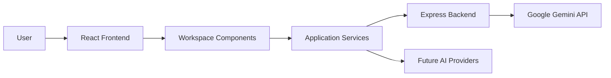

# Solaris

<p align="center">
  
</p>

<p align="center">
  <strong>A modular AI workspace for research, development, and intelligent workflows.</strong><br>
  Bringing conversations, projects, and interactive tools together in a single environment.
</p>

<p align="center">


</p>

<p align="center">

### 🌐 Live Demo

**https://343c8eb2.solaris-core.pages.dev/**

</p>

---

# Preview

The screenshots below represent different parts of the workspace. Replace the placeholder files with actual captures from the latest version of Solaris.

| Landing                      | Workspace                      |
| ---------------------------- | ------------------------------ |
| | 
 |

| AI Chat                   | Interactive Module          |
| ------------------------- | --------------------------- |
||

 |

---

# In Action

Short demonstrations communicate far more than paragraphs of explanation.

| Launch                     | Navigation                    |
| -------------------------- | ----------------------------- |
|| 
# Table of Contents

* [Overview](#overview)
* [Why Solaris?](#why-solaris)
* [Core Ideas](#core-ideas)
* [Quick Start](#quick-start)
* [Documentation](#documentation)

---

# Overview

Solaris is a modular AI workspace that combines conversation, project organization, research, and interactive development tools inside a single application.

The project grew from a simple observation. Working on software often means moving between documentation, AI assistants, code editors, notes, browser tabs, and project management tools. Every switch interrupts the flow of work and fragments the context you've already built.

Solaris explores a different direction.

Instead of treating AI as the destination, it treats AI as one component inside a larger workspace. Conversations exist alongside project planning, interactive modules, visual tools, and experiments that support longer engineering sessions rather than isolated prompts.

The project began as a personal learning exercise and gradually expanded into something much larger. Every iteration introduced new challenges: organizing growing codebases, designing reusable components, integrating external AI services, managing application state, and building interfaces that remain maintainable as complexity increases.

Solaris has become the environment where I experiment, refactor, and apply new ideas as I continue learning software engineering through real projects instead of isolated tutorials.

---

# Why Solaris?

Most AI applications begin and end with a conversation.

A prompt is submitted.

The model generates a response.

The interaction gradually loses value as the surrounding project evolves.

Software development rarely works that way.

Research becomes documentation.

Documentation becomes implementation.

Implementation produces new questions.

Those questions influence future design decisions, and the cycle repeats.

Solaris was built around that process.

Rather than separating conversations from development, the workspace keeps related tools close together so ideas can move naturally from planning to implementation without forcing users to rebuild context every time they change tasks.

The project doesn't attempt to replace existing development tools. It investigates how AI can become part of an engineering workflow instead of existing beside it.

---

# Core Ideas

The architecture of Solaris is guided by a few consistent principles.

* **Projects over prompts** — Conversations should support ongoing work rather than isolated questions.
* **Modular design** — Independent features should evolve without requiring the entire application to be redesigned.
* **Learning through building** — Every feature is an opportunity to understand a new technology, architectural pattern, or engineering challenge.
* **Refactoring is part of development** — Code is expected to improve over time. Rewriting earlier implementations is treated as progress, not failure.
* **Transparency** — Modern AI-assisted development tools contributed to parts of the implementation, but architectural decisions, feature design, integration, debugging, customization, and long-term direction remained my responsibility throughout development.

These ideas influence every major change made to the project.

---
# Documentation

The README focuses on understanding Solaris and getting it running.

Additional documents provide a deeper look into different parts of the project.

| Document          | Purpose                                                             |
| ----------------- | ------------------------------------------------------------------- |
| `ARCHITECTURE.md` | System architecture, data flow, and engineering decisions.          |
| `FEATURES.md`     | Complete breakdown of every workspace module.                       |
| `AI.md`           | AI integration, provider architecture, and request pipeline.        |
| `PERFORMANCE.md`  | Rendering, optimization strategies, and performance considerations. |
| `DEVELOPMENT.md`  | Development workflow, coding standards, and project organization.   |
| `ROADMAP.md`      | Planned features, architectural goals, and future milestones.       |

The repository is designed to grow alongside the software. As Solaris evolves, the documentation evolves with it so that implementation details remain discoverable without turning the README into a reference manual.
---

# Features

Solaris is organized as a collection of independent modules rather than a single monolithic application. Each module has a clear responsibility, allowing the project to grow without forcing unrelated parts of the codebase to change together. That separation has made experimentation easier and reduced the cost of refactoring as new ideas emerge.

## AI Workspace

The workspace is the center of the application. Instead of presenting AI as a standalone chatbot, Solaris treats it as one tool within a broader development environment.

Conversations are intended to exist alongside research, planning, and implementation. The goal is to reduce context switching by allowing users to work within a single interface rather than constantly moving between different applications.

As the project evolves, the workspace is intended to support richer context management, multiple AI providers, persistent project memory, and tighter integration between conversations and the surrounding environment.

---

## Interactive User Interface

The interface prioritizes responsiveness over visual complexity.

Animations provide feedback without delaying interaction. Components appear and disappear smoothly, navigation remains predictable, and transitions help communicate changes in application state rather than serving as decoration.

Every visual effect is expected to improve usability. If an animation slows navigation or distracts from the workflow, it does not belong in the project.

---

## Modular Architecture

One of the earliest lessons from building Solaris was that tightly coupled code becomes difficult to maintain as projects grow.

The application is therefore divided into reusable modules with clearly defined responsibilities. Individual components can be modified, replaced, or expanded without requiring large portions of the application to be rewritten.

This approach has already simplified several refactoring efforts and provides a stronger foundation for future features.

---

## Interactive Graphics

Solaris includes experimental graphics built with Three.js and React Three Fiber.

These modules serve two purposes. They introduce interactive visual experiences into the workspace while also acting as practical exercises in learning browser rendering, scene management, lighting, camera systems, animation loops, and GPU-accelerated graphics.

Rather than existing as isolated demonstrations, these experiments help shape the project's broader understanding of interactive software design.

---

## Backend Services

External AI providers are intentionally separated from the frontend.

Instead of exposing API communication directly inside client-side components, requests pass through an Express service layer responsible for handling communication with external services.

This separation improves maintainability, keeps credentials outside the browser, and creates a single location for logging, validation, middleware, and future provider integrations.

As additional models are introduced, the frontend should require little or no modification.

---

## Responsive Design

The interface is designed to adapt to different screen sizes while maintaining a consistent experience.

Layouts reorganize naturally across desktop and smaller displays without requiring separate implementations. Components are intended to remain reusable regardless of the available screen space, reducing duplicated code throughout the interface.

---

# Technology Stack

Every technology in Solaris was selected to solve a practical engineering problem. The stack reflects the requirements of the project rather than current trends.

| Layer           | Technology                   | Why it was chosen                                                            |
| --------------- | ---------------------------- | ---------------------------------------------------------------------------- |
| Frontend        | React 19                     | Component-based architecture with efficient UI updates.                      |
| Language        | TypeScript                   | Static typing improves maintainability and catches errors earlier.           |
| Build Tool      | Vite                         | Fast development server and optimized production builds.                     |
| Styling         | Tailwind CSS                 | Utility-first styling keeps components consistent while reducing custom CSS. |
| Backend         | Express.js                   | Lightweight service layer between the client and external APIs.              |
| AI              | Google Gemini                | Modern multimodal language model with accessible API integration.            |
| Graphics        | Three.js & React Three Fiber | Browser-based 3D rendering and interactive graphics.                         |
| Package Manager | npm                          | Dependency management and development tooling.                               |
| Version Control | Git & GitHub                 | Source control, collaboration, and project history.                          |

The stack is intentionally conservative. Each technology has a mature ecosystem, strong documentation, and enough flexibility to support future expansion without introducing unnecessary complexity.

---

# Architecture at a Glance

Solaris follows a layered architecture that separates presentation, application logic, and external services.



The React frontend manages the user interface and application state. Business logic is organized into reusable services, reducing direct dependencies between interface components and backend communication.

The Express backend acts as an intermediary between the client and external AI providers. This keeps API credentials outside the browser while making it easier to introduce additional providers, authentication layers, analytics, or request logging without restructuring the frontend.

Future development will continue strengthening these boundaries so that new functionality can be introduced with minimal impact on existing modules.

---

# Engineering Principles

Many software projects begin with features and discover their architecture later.

Solaris developed in the opposite direction.

As the project grew, recurring problems became easier to recognize. Components that handled too many responsibilities were separated. Repeated logic moved into reusable services. Earlier implementations were rewritten when cleaner abstractions emerged.

Refactoring became part of normal development rather than something postponed until later.

This philosophy influences every architectural decision inside the repository.

### Build for Change

Requirements evolve.

Ideas improve.

Architecture should expect that.

Rather than optimizing for the current version of Solaris, the project is organized so future versions can replace existing implementations without forcing large-scale rewrites.

### Separate Responsibilities

Interface components should present information.

Services should perform work.

Backend layers should communicate with external systems.

Keeping those responsibilities separate makes debugging easier, simplifies testing, and reduces unintended side effects.

### Learn Through Implementation

Reading documentation introduces concepts.

Building software exposes misunderstandings.

Many parts of Solaris exist because they provided an opportunity to explore unfamiliar areas of software engineering, including backend architecture, browser graphics, state management, animation systems, AI integration, and component design.

Every completed feature has served two purposes: improving the application and improving the developer building it.

### Engineering Before Appearance

A polished interface matters, but appearance cannot compensate for weak architecture.

The long-term quality of Solaris depends far more on maintainable code, clear abstractions, modular design, and thoughtful engineering decisions than visual effects alone.

That perspective continues to shape the direction of the project as new functionality is added.

---

# Looking Ahead

The current implementation represents one stage in a much longer journey.

Future work will focus on expanding modularity, introducing additional AI providers, strengthening long-term project memory, improving state management, refining the plugin architecture, and continuing to simplify the internal structure as the codebase grows.

The goal is not to avoid rewriting code.

The goal is to make rewriting individual parts straightforward because the surrounding architecture was designed with change in mind.
---

# Repository Structure

Solaris is organized to keep features independent, encourage reuse, and make future expansion easier. As the project has grown, the folder structure has evolved alongside it. Directories are organized around responsibility rather than file type wherever practical, making it easier to understand where new functionality belongs.

```text
Solaris-Core
│
├── src
│   ├── components
│   ├── pages
│   ├── hooks
│   ├── services
│   ├── providers
│   ├── animations
│   ├── assets
│   ├── styles
│   ├── utils
│   ├── types
│   └── App.tsx
│
├── server
│   ├── routes
│   ├── middleware
│   ├── services
│   └── index.ts
│
├── public
│
├── docs
│   ├── images
│   ├── gifs
│   ├── diagrams
│   └── assets
│
├── README.md
├── ARCHITECTURE.md
├── FEATURES.md
├── AI.md
├── PERFORMANCE.md
├── DEVELOPMENT.md
├── ROADMAP.md
├── CONTRIBUTING.md
├── CHANGELOG.md
├── SECURITY.md
└── LICENSE
```

This organization isn't fixed. New modules will continue to reshape the repository as Solaris grows. The objective is to keep the codebase understandable rather than preserving a structure simply because it existed first.

---

# Documentation

The README provides an overview of the project, but much of the engineering detail lives in dedicated documents. Splitting documentation by topic keeps each file focused and makes specific information easier to find.

| Document            | Description                                                                            |
| ------------------- | -------------------------------------------------------------------------------------- |
| **README.md**       | Project overview, installation, and getting started.                                   |
| **ARCHITECTURE.md** | System architecture, request flow, component relationships, and engineering decisions. |
| **FEATURES.md**     | Detailed explanation of every module and major capability.                             |
| **AI.md**           | AI integration, provider abstraction, prompt routing, and future model support.        |
| **PERFORMANCE.md**  | Rendering strategy, optimization techniques, and performance considerations.           |
| **DEVELOPMENT.md**  | Development workflow, coding standards, and project organization.                      |
| **ROADMAP.md**      | Planned improvements and long-term direction.                                          |
| **CONTRIBUTING.md** | Guidelines for contributors and pull requests.                                         |
| **CHANGELOG.md**    | Project history across releases.                                                       |
| **SECURITY.md**     | Security reporting process and responsible disclosure policy.                          |

Each document exists because a single README cannot explain every engineering decision without becoming difficult to navigate.

---

# Project Roadmap

Solaris continues to evolve as new ideas replace older implementations. The roadmap reflects areas that will have the greatest impact on the project's architecture rather than simply adding more features.

### Near Term

* Improve workspace organization.
* Expand AI capabilities.
* Refine responsive layouts.
* Continue component refactoring.
* Increase automated testing.
* Improve documentation coverage.

### Mid Term

* Multi-provider AI support.
* Plugin architecture.
* Better project memory.
* Workspace persistence.
* Improved backend abstraction.
* Enhanced developer tools.

### Long Term

* Local AI model support.
* Collaborative workspaces.
* Cross-device synchronization.
* Advanced workflow automation.
* Offline functionality.
* Expanded visualization modules.

These goals are intentionally flexible. As Solaris grows, new ideas will replace older assumptions, and the roadmap will adapt alongside the software.

---

# About the Developer

Hi, I'm **Mayank Suryawanshi**.

I'm currently pursuing a **Diploma + Degree in Electronics and Telecommunication Engineering with an AI/ML specialization** at **MIT-WPU** in Pune, India.

I enjoy building software that pushes me beyond what I already know. Rather than learning technologies one at a time, I prefer building projects that force different ideas to work together. That approach has introduced me to frontend development, backend engineering, software architecture, graphics programming, artificial intelligence, and modern development workflows through practical experience.

Solaris is the largest project I've built so far. It represents hundreds of hours of experimentation, debugging, redesign, and learning. Many parts of the application have been rewritten more than once as I developed a better understanding of software architecture and maintainable code.

Like many developers today, I used AI-assisted development tools during parts of the project. They helped explain unfamiliar concepts, speed up repetitive implementation, and provide alternative approaches when I reached difficult problems. The architectural decisions, feature planning, integration work, customization, debugging, testing, and long-term direction remained my responsibility throughout development.

I'm less interested in collecting technologies than understanding how they work together. Every project I build is another opportunity to improve that understanding.

---

# Contributing

Although Solaris began as a personal project, thoughtful contributions are always welcome.

If you discover a bug, identify a cleaner implementation, improve documentation, or have an idea worth exploring, feel free to open an issue or submit a pull request.

Constructive feedback is especially valuable when it explains *why* an alternative approach is better. Engineering discussions often lead to stronger software than isolated development.

Before contributing, please read **CONTRIBUTING.md** for coding standards, project structure, and pull request guidelines.

---

# Acknowledgements

Solaris exists because of the broader open-source community.

Projects such as React, Express, TypeScript, Tailwind CSS, Three.js, Vite, and many smaller libraries provide the foundation that makes software like this possible. Their maintainers invest enormous amounts of time into tools that thousands of developers rely on every day.

I also appreciate the growing ecosystem of AI-assisted development tools. Used thoughtfully, they can reduce repetitive work, explain unfamiliar concepts, and accelerate learning. They are most valuable when paired with curiosity, experimentation, and a willingness to understand the underlying engineering rather than simply accepting generated code.

---

# Explore Solaris

🌐 **Live Demo**

**https://343c8eb2.solaris-core.pages.dev/**

If you'd like to see the latest version of Solaris in action, the live demo reflects the current state of development. As the project evolves, new features and improvements will continue to appear there before they become part of future releases.

---

# Final Notes

Software projects are snapshots of what their authors understand at a particular point in time.

Solaris reflects my current understanding of software engineering. Some parts already represent ideas I'm proud of. Others will eventually be redesigned because I've learned better approaches. That cycle of building, questioning, refactoring, and improving is one of the most rewarding aspects of engineering.

If this repository helps another student understand a concept, inspires someone to begin building their own projects, or starts a discussion about better software design, then it has already achieved more than I originally expected.

Thank you for taking the time to explore Solaris.
