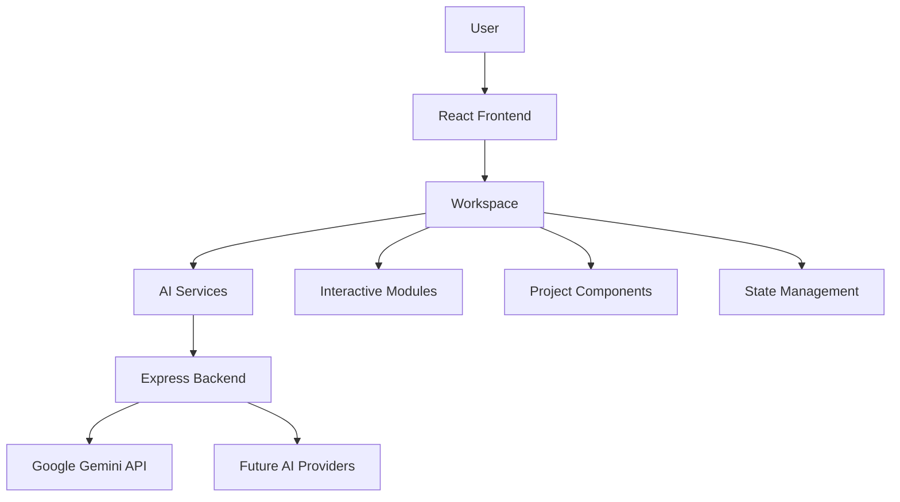
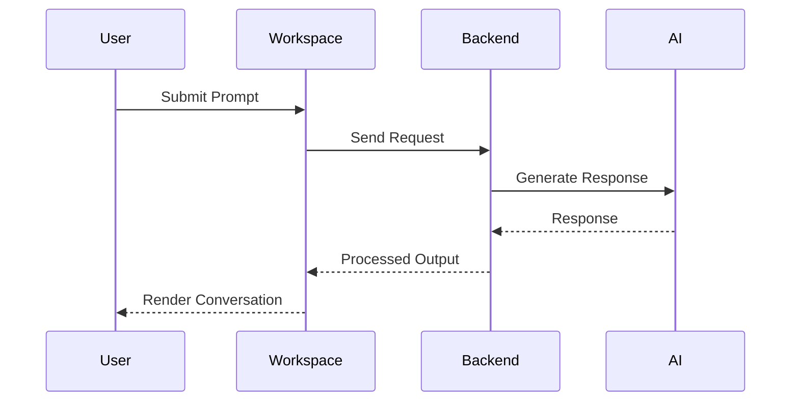
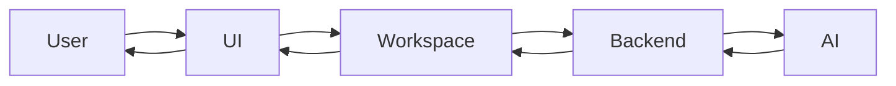

# Solaris AI Ecosystem

<p align="center">


</p>

<p align="center">

<strong>An AI workspace designed around projects instead of conversations.</strong>

</p>

<p align="center">


</p>

<p align="center">

🌐 **Live Demo**

https://9b1ec6a8.soloris-ai.pages.dev/

</p>

---

## Preview

<p align="center">


*The main Solaris workspace.*

</p>

<p align="center">


*Switching between modules.*

</p>

<p align="center">


*Context-aware conversations.*

</p>

---

## What is Solaris?

Solaris AI Ecosystem is a personal software engineering project that explores what happens when AI becomes part of an entire workspace instead of living inside a single chat window.

Most AI applications are designed around isolated conversations. You ask a question, receive an answer, and start over when the context changes. Real work rarely happens that way. Research leads to notes, notes become plans, plans become code, and every step depends on information gathered earlier.

Solaris was built around that observation.

Rather than treating AI as a standalone assistant, the project brings together research, writing, coding, project organization, and interactive tools inside one environment where each part contributes to the same workflow. The goal is to reduce the friction created by constantly switching between applications while preserving context throughout the development process.

The project began as a small experiment while I was learning modern web development. As new ideas emerged, it gradually evolved into a larger system that now serves as both a development platform and a learning environment. Every feature has been an opportunity to understand software architecture, interface design, state management, AI integration, and the practical challenges of building applications that continue growing over time.

---

## Why I Built It

Most software projects begin with a specific problem to solve. Solaris began with a question.

What would an AI workspace look like if it were designed for building projects instead of answering prompts?

Existing tools are excellent at generating text, but I often found myself moving between documentation, notes, browser tabs, development environments, and AI assistants while working on a single idea. Every transition interrupted the flow of work and forced me to repeat context that the software had already seen before.

Solaris became an attempt to explore a different approach. Instead of building another chatbot, I focused on creating a workspace where different tools could exist together, share information, and support longer engineering sessions without constantly resetting the conversation.

The project continues to evolve as my understanding of software engineering grows. Earlier implementations have been rewritten, features have changed direction, and the architecture has gradually become more modular. That process has taught me far more than following tutorials ever could.

---

## Philosophy

I don't see Solaris as a finished product.

I see it as a long-term engineering project.

Some ideas work well. Others are replaced after discovering better approaches. That cycle of building, evaluating, refactoring, and rebuilding has become one of the most valuable parts of the project.

Like many modern software projects, Solaris was developed with the assistance of AI coding tools alongside my own work. AI helped accelerate development, generate implementation ideas, and reduce repetitive coding tasks. The application's architecture, feature design, integration, debugging, customization, and long-term direction remain decisions that I made throughout development.

As I continue studying Electronics and Telecommunication Engineering with AI/ML, Solaris serves as the place where I can apply new concepts, experiment with different technologies, and gradually develop the engineering habits required to build larger software systems.

---

# Features & Workspace Tour

Solaris is organized around independent modules that work together inside a shared workspace. Instead of opening separate applications for writing, research, planning, or interacting with AI, everything lives inside one environment where each component contributes to the same workflow.

The project continues to evolve, so some modules are experimental while others are stable enough for everyday use. Every feature exists because it solved a problem I encountered while building software or studying.

---

# Workspace

<p align="center">


*The primary Solaris workspace.*

</p>

The workspace acts as the center of the application. Every module is accessible from here without interrupting the user's current session. Rather than forcing separate pages for every feature, Solaris keeps related tools close together so that moving between tasks feels natural.

The interface is designed to minimize unnecessary context switching. Conversations, projects, tools, and interactive modules remain available without constantly reopening windows or rebuilding previous work.

---

# AI Conversations

<p align="center">


*Working with AI inside Solaris.*

</p>

At its core, Solaris provides a conversational interface that supports multiple AI-powered workflows. Instead of treating each interaction as an isolated request, the goal is to create conversations that remain useful while larger projects develop over time.

Current capabilities include:

* Context-aware conversations
* Multiple AI model support
* Long-form responses
* Project-focused discussions
* Interactive workspace integration

The emphasis is less on generating isolated answers and more on supporting continuous work sessions where ideas naturally evolve.

---

# Modular Design

<p align="center">


*Switching between workspace modules.*

</p>

Rather than placing every feature inside a single interface, Solaris separates functionality into dedicated modules.

Each module focuses on one responsibility while remaining connected to the larger workspace.

Examples include:

* AI workspace
* Interactive canvases
* Physics experiments
* Video analysis
* Research utilities
* Project management tools
* Workspace navigation
* Custom interface components

This modular structure makes it easier to expand the application without redesigning the entire interface whenever a new feature is introduced.

---

# Interactive Environment

<p align="center">


*Interactive interface elements throughout Solaris.*

</p>

The interface was built with experimentation in mind.

Instead of relying entirely on traditional layouts, Solaris incorporates animated components, interactive panels, visual transitions, and real-time feedback to make the workspace feel responsive while avoiding unnecessary distractions.

Animations are used to communicate state changes rather than simply decorate the interface.

---

# 3D Experiences

<p align="center">


*Three.js powered visual experiences.*

</p>

Solaris includes experimental 3D environments built with Three.js and React Three Fiber.

These components serve two purposes.

First, they provide interactive visual experiences that go beyond standard dashboards.

Second, they act as learning projects for understanding graphics programming, rendering pipelines, scene management, and real-time interaction inside modern web applications.

Some of these modules continue to evolve as new ideas are explored.

---

# AI Model Support

<p align="center">


*Switching between supported AI models.*

</p>

Different workflows often benefit from different AI models.

Solaris is designed so that model selection becomes part of the workspace instead of requiring users to leave the application whenever a different model is needed.

The abstraction layer also makes it easier to expand support in the future without rewriting large parts of the interface.

---

# Project-Oriented Workflow

Most AI applications revolve around prompts.

Solaris revolves around projects.

A typical workflow looks something like this:

```text
Idea
   │
   ▼
Research
   │
   ▼
AI Conversation
   │
   ▼
Planning
   │
   ▼
Writing
   │
   ▼
Development
   │
   ▼
Iteration
```

Instead of starting from an empty conversation every time, different parts of the workspace contribute to the same ongoing process.

---

# Designed to Grow

One of the earliest lessons I learned while building Solaris was that software architecture matters long before a project becomes large.

Many modules started as small experiments before gradually becoming independent features. As the application continues to evolve, the architecture is being refactored into smaller, more maintainable pieces that make future development easier.

That process is still ongoing, and it has become one of the most valuable parts of the project from a learning perspective.

---

# Current Capabilities

* Modular AI workspace
* Multi-model AI integration
* Interactive user interface
* Context-aware conversations
* Three.js visual experiences
* Physics-inspired interactive modules
* Video processing experiments
* Responsive workspace layout
* Real-time interface updates
* Custom UI components
* Express backend
* TypeScript codebase
* React 19 frontend
* Vite development environment
* Tailwind CSS styling
* Extensible architecture for future modules

---

# What's Next

Solaris is still under active development.

Future updates will focus less on adding isolated features and more on improving architecture, maintainability, developer experience, and long-term scalability. The project is gradually moving toward a cleaner separation between interface components, application logic, backend services, and AI orchestration while continuing to explore new ideas for intelligent workflows.

---

# Architecture

Software projects gradually become difficult to maintain when every new feature depends on every existing one. Solaris has reached the point where architecture matters as much as functionality, and much of the current development focuses on improving how different parts of the application communicate rather than simply adding new capabilities.

The application follows a layered architecture that separates the user interface, application logic, AI services, and backend into distinct responsibilities. While the project is still evolving, this structure has made it easier to experiment with new ideas without rebuilding the entire application.



The goal is simple. The interface should focus on presenting information, while the backend manages communication with external services. Keeping these responsibilities separate makes future changes less disruptive.

---

# Frontend Architecture

<p align="center">


</p>

The frontend is built with **React 19**, **TypeScript**, **Vite**, and **Tailwind CSS**.

React provides the component-based structure used throughout the workspace, while TypeScript improves reliability by introducing stronger type checking as the application grows.

Vite was selected because it offers a fast development environment with efficient hot module replacement, making experimentation considerably faster than traditional build systems.

The interface itself is divided into reusable components that represent different areas of the workspace rather than individual pages. This approach allows features to evolve independently while still sharing application state where appropriate.

Current frontend responsibilities include:

* Rendering the workspace
* Managing application state
* User interaction
* AI conversations
* Navigation
* Interactive modules
* 3D rendering
* Visual feedback
* Responsive layouts

---

# Component Philosophy

Rather than creating large page-oriented layouts, Solaris is gradually moving toward smaller feature-oriented components.

A simplified component hierarchy looks like this:

```text
Workspace
│
├── Sidebar
├── Chat Interface
├── AI Controls
├── Workspace Modules
├── Canvas Components
├── Physics Space
├── Video Detection
├── Model Manager
└── Settings
```

This structure makes it easier to introduce new modules without redesigning the workspace.

As the project continues to expand, larger components are gradually being refactored into smaller units with clearly defined responsibilities.

---

# Backend

<p align="center">


</p>

The backend currently uses **Express.js** as a lightweight service layer between the frontend and external AI providers.

Instead of allowing the client to communicate directly with AI services, requests pass through the backend where configuration, routing, and future processing can be managed in a central location.

This separation offers several advantages.

* API keys remain outside the client application.
* AI providers can be replaced without changing frontend code.
* Additional middleware can be introduced later.
* Authentication becomes easier to implement.
* Logging and monitoring remain centralized.

The backend intentionally remains lightweight because most application logic currently lives within the frontend while the architecture continues to mature.

---

# AI Pipeline

The AI layer acts as a bridge between the user and external language models.

Instead of tightly coupling the interface to a single provider, Solaris abstracts the interaction behind dedicated services.

A simplified request flow looks like this.



This design makes future provider integration significantly easier because only the service layer needs to change.

---

# State Management

Managing application state becomes increasingly difficult as projects grow.

Solaris currently relies on React's state management capabilities while gradually introducing cleaner separation between interface logic and application logic.

The long-term direction is to reduce the amount of business logic inside UI components by moving reusable behavior into dedicated services and custom hooks.

That approach improves readability while making individual modules easier to test and maintain.

---

# Three-Dimensional Experiences

One area that makes Solaris different from many traditional productivity applications is its experimentation with real-time graphics.

Several workspace modules use **Three.js** together with **React Three Fiber** to render interactive visual environments directly inside the browser.

These environments are not intended as visual demonstrations alone.

Building them provided practical experience with:

* Scene management
* Camera systems
* Object hierarchies
* Animation loops
* Real-time rendering
* User interaction
* Performance optimization

Those lessons continue to influence other parts of the application.

---

# Data Flow

The application follows a predictable flow from user interaction to rendered response.



Keeping this flow consistent reduces complexity as additional features are introduced.

---

# Project Structure

The repository is organized around the idea of separating responsibilities wherever possible.

```text
Solaris-Core

├── src
│   ├── components
│   ├── assets
│   ├── hooks
│   ├── services
│   ├── utils
│   ├── types
│   └── styles
│
├── server
│
├── public
│
├── docs
│
└── package.json
```

As Solaris continues to evolve, the project is gradually moving toward a more modular architecture where application logic, interface components, AI services, and shared utilities remain isolated from one another.

---

# Engineering Decisions

Every technology used inside Solaris was chosen because it solved a specific problem during development.

| Technology        | Purpose                    |
| ----------------- | -------------------------- |
| React 19          | Component-based interface  |
| TypeScript        | Static type safety         |
| Vite              | Fast development workflow  |
| Tailwind CSS      | Utility-first styling      |
| Express           | Backend service layer      |
| Google Gemini     | AI capabilities            |
| Three.js          | Real-time 3D rendering     |
| React Three Fiber | Declarative 3D development |
| Motion            | Interface animation        |

The stack continues to evolve as new requirements appear, but the guiding principle remains the same: choose tools that simplify development while keeping the architecture understandable.

---

# Looking Ahead

Solaris has reached the stage where engineering quality has become just as important as feature development.

Current work is focused on improving modularity, reducing component complexity, introducing stronger separation between interface and business logic, and creating an architecture that can continue growing without becoming increasingly difficult to maintain.

Every refactor makes the project easier to understand, easier to extend, and a better representation of the engineering practices I continue to learn through building it.

---

# Performance, Development & Project Structure

Building features is only part of developing software. As Solaris grew, the focus gradually shifted toward reducing complexity, improving responsiveness, and creating an environment that remained comfortable to work in as new functionality was introduced.

Many of the decisions behind the project were driven by development experience rather than theoretical optimization. Whenever a part of the application became difficult to modify, it usually meant the architecture needed attention before another feature was added.

---

# Performance Philosophy

Performance is often associated with benchmark numbers, but responsiveness begins much earlier than that.

An application should feel immediate.

Buttons should react instantly. Navigation should remain smooth. Loading states should communicate progress instead of leaving the interface frozen. Those details shape the overall experience long before raw rendering speed becomes the limiting factor.

Solaris approaches performance from several directions rather than depending on one optimization.

Current development focuses on:

* Reducing unnecessary component renders
* Keeping expensive logic outside presentation components
* Separating application logic from interface rendering
* Using Vite for fast development builds
* Leveraging React's rendering model efficiently
* Organizing components so updates remain localized

As the project grows, profiling and performance monitoring will become a larger part of development.

---

# Rendering Pipeline

```mermaid
flowchart LR

User

--> UI

UI

--> React Components

React Components

--> State Updates

State Updates

--> Render Queue

Render Queue

--> Browser

Browser

--> User
```

Keeping updates predictable makes the application easier to reason about and easier to optimize later.

---

# Technology Stack

Solaris combines modern frontend technologies with a lightweight backend and several libraries chosen for specific responsibilities rather than popularity.

| Category       | Technology        |
| -------------- | ----------------- |
| Language       | TypeScript        |
| Frontend       | React 19          |
| Build Tool     | Vite              |
| Styling        | Tailwind CSS      |
| Backend        | Express.js        |
| AI             | Google Gemini API |
| 3D Graphics    | Three.js          |
| React Renderer | React Three Fiber |
| Animation      | Motion            |
| Mobile         | Capacitor         |

Each technology contributes one part of the application without introducing unnecessary complexity.

---

# Why This Stack?

React encourages reusable interfaces and predictable rendering.

TypeScript reduces runtime errors by catching many mistakes during development.

Vite dramatically improves build speed and keeps development iterations fast.

Tailwind CSS removes much of the repetitive work involved in styling while still allowing complete control over the interface.

Express provides a lightweight backend capable of handling API communication without introducing unnecessary overhead.

Three.js opens the door to interactive graphics and visual experimentation directly inside the browser.

Each choice reflects a practical problem encountered while building Solaris rather than following a technology trend.

---

# Development Workflow

Every feature follows roughly the same lifecycle.

```text
Idea

↓

Research

↓

Planning

↓

Prototype

↓

Testing

↓

Refactoring

↓

Integration

↓

Iteration
```

Many ideas never move beyond the prototype stage.

Keeping experimental work separate from stable functionality has made the project easier to evolve over time.

---

# Folder Structure

The repository continues moving toward a feature-oriented structure.

```text
Solaris-Core

├── src
│
├── assets
│
├── components
│
├── hooks
│
├── services
│
├── utils
│
├── styles
│
├── types
│
├── pages
│
└── App.tsx

server

public

docs
```

The intention is to keep application logic, presentation components, utilities, and shared services separated as the project expands.

Future refactoring will continue reducing the size of larger files while increasing modularity throughout the application.

---

# Running Solaris

### Clone the repository

```bash
git clone https://github.com/<username>/Solaris-Core.git
```

### Install dependencies

```bash
npm install
```

### Start the development server

```bash
npm run dev
```

### Start the backend

```bash
npm run server
```

After both services are running, Solaris will be available through the local development server.

---

# Environment Variables

External services are configured through environment variables rather than embedding sensitive information directly inside the application.

```env
GEMINI_API_KEY=your_api_key_here

PORT=3000
```

Keeping configuration outside the source code improves portability and reduces the risk of accidentally exposing credentials.

---

# Development Principles

Several ideas guide development regardless of which module is being worked on.

* Build small features before expanding them.
* Refactor whenever complexity begins to slow development.
* Prefer readable code over clever code.
* Separate responsibilities whenever practical.
* Experiment freely, then simplify.
* Avoid adding dependencies without a clear reason.

Those principles have gradually shaped the project more than any individual technology.

---

# Challenges

Every larger project eventually reaches the point where adding features becomes easier than maintaining them.

Solaris has already encountered several of those moments.

The largest challenge has been balancing experimentation with maintainability. New ideas often begin as small additions before growing into complete modules. As that happens, earlier architectural decisions no longer fit the scale of the project.

Another challenge has been managing application state across increasingly complex interactions. Features that originally worked independently now share information across different parts of the workspace, requiring a cleaner separation between interface logic and business logic.

Performance has also become a continuing area of attention. Interactive interfaces, AI requests, animations, and 3D rendering introduce different constraints, making careful organization more valuable than premature optimization.

These challenges are part of the reason Solaris exists. Solving them has provided practical experience that would have been difficult to gain from tutorials alone.

---

# Measuring Progress

The project isn't measured by the number of features it contains.

Instead, progress is judged by different questions.

Can a new feature be added without rewriting existing code?

Is the architecture becoming easier to understand?

Can individual modules evolve independently?

Would another developer be able to contribute after reading the documentation?

Those questions have become increasingly important as Solaris continues to grow from a learning project into a larger software system.
---

# Design Decisions, Lessons Learned & Future Direction

Every project reaches a point where adding another feature becomes easier than maintaining the existing ones. Solaris is currently at that stage. The project began as a collection of ideas and gradually evolved into a larger application with its own architecture, development patterns, and engineering challenges.

Looking back at earlier versions, many of the decisions that felt reasonable at the time eventually became limitations. Refactoring those decisions has been just as valuable as writing new features because it exposed the trade-offs involved in building software that continues to grow over time.

---

# Why Another AI Workspace?

Large language models have become increasingly capable, but most applications built around them still follow the same interaction model.

The user opens a chat.

They ask a question.

The model responds.

The conversation ends.

That approach works well for isolated questions, but software development, research, planning, and long-term projects rarely happen in isolated conversations. Ideas evolve over hours, days, and sometimes months. Notes become documentation, documentation becomes code, code introduces new questions, and every stage depends on previous work.

Solaris explores a different workflow.

Instead of building another chatbot, the project attempts to create a workspace where AI exists as one part of a larger environment. Research, writing, visualization, planning, and development are treated as connected activities rather than separate applications.

The goal isn't to replace existing tools. It's to reduce the friction created by constantly moving between them.

---

# Design Principles

Several principles guide every major decision made during development.

### Build for growth

Many personal projects work well until they reach a certain size. After that point, every new feature becomes increasingly difficult to integrate because the architecture was never designed to expand.

Solaris is gradually moving toward a modular structure where independent features can evolve without requiring major changes throughout the application.

---

### Keep experimentation inexpensive

Not every idea deserves to become a permanent feature.

Many modules begin as experiments before either being expanded, redesigned, or removed entirely. Keeping experimental work isolated allows new ideas to be explored without destabilizing the rest of the project.

---

### Learn by building

The purpose of Solaris extends beyond creating a finished application.

Each feature serves as an opportunity to understand a new concept.

Some modules were built to learn React.

Others explored TypeScript, Express, Three.js, AI integration, state management, interface design, animation systems, or software architecture.

The project has become a practical learning environment where every implementation teaches something beyond the feature itself.

---

# Why These Technologies?

Technology choices were driven by practical requirements rather than trends.

### React

React encourages reusable components and predictable rendering while remaining flexible enough to support a growing workspace.

---

### TypeScript

As Solaris expanded, stronger typing became increasingly valuable. TypeScript catches many mistakes before the application even runs and makes larger codebases easier to understand.

---

### Vite

Fast development cycles matter.

Waiting for builds interrupts experimentation, and experimentation has always been central to this project. Vite keeps feedback nearly immediate, allowing ideas to be tested quickly.

---

### Express

The backend intentionally remains lightweight.

Its primary responsibility is handling communication with external services while keeping sensitive configuration outside the frontend. This separation also leaves room for authentication, logging, additional AI providers, and future backend services.

---

### Three.js

Three.js wasn't added simply because 3D graphics look interesting.

It introduced an opportunity to learn rendering pipelines, scene management, object hierarchies, lighting, animation, and interactive graphics—topics that extend beyond traditional web development.

---

# The Role of AI During Development

Modern software development increasingly includes AI-assisted tooling, and Solaris is no exception.

AI contributed to parts of the implementation by accelerating repetitive work, suggesting alternative approaches, generating boilerplate, explaining unfamiliar concepts, and helping debug problems encountered during development.

The project's direction, architecture, feature selection, interface design, integration strategy, debugging process, refactoring decisions, and long-term vision remained my responsibility throughout development.

AI acted as a development tool rather than an autonomous author.

That distinction matters because understanding why a solution works is considerably more valuable than simply generating code that appears to work.

---

# Lessons Learned

The project has taught lessons that would have been difficult to gain from tutorials alone.

One of the earliest lessons was that architecture eventually becomes more important than features.

Adding functionality is usually straightforward.

Maintaining it over time is considerably harder.

Another lesson involved code organization.

Several components grew far larger than originally intended because they accumulated responsibilities over multiple development cycles. Refactoring those components revealed the importance of separating presentation, business logic, state management, and services before complexity becomes difficult to control.

Debugging also became an important teacher.

Many issues initially appeared to be framework problems before turning out to be assumptions made during implementation. Tracing those problems back to their source gradually improved both development habits and problem-solving skills.

Perhaps the most valuable lesson was learning to rewrite code without treating previous work as untouchable. Software improves through iteration, and replacing an earlier implementation with a better one is often progress rather than failure.

---

# Challenges

Building Solaris introduced several recurring challenges.

Managing application state across increasingly connected features became more difficult as the workspace expanded.

Maintaining responsiveness while introducing richer interactions required careful organization of rendering logic.

Balancing experimentation with maintainability often meant deciding between implementing a new idea immediately or spending time improving the existing architecture first.

Many of these challenges remain active areas of development, and solving them continues to shape the direction of the project.

---

# Looking Forward

Solaris remains an active engineering project rather than a finished application.

Several long-term ideas continue to guide development.

### Architecture

Continue breaking larger components into smaller feature-oriented modules with clearly defined responsibilities.

---

### AI

Expand provider support while introducing cleaner abstractions between the interface and external models.

---

### Plugins

Allow independent modules to be installed without modifying the core application.

---

### Long-Term Memory

Develop more persistent project context capable of supporting extended workflows across multiple sessions.

---

### Collaboration

Introduce shared workspaces where multiple users can contribute to the same projects while preserving context.

---

### Local Models

Investigate support for locally hosted language models alongside cloud-based providers.

---

### Mobile Experience

Continue exploring how the workspace can be adapted for mobile devices without sacrificing usability.

---

### Testing

Increase automated testing coverage while separating business logic from presentation components to simplify verification.

---

# Personal Reflection

Solaris has grown far beyond its original scope.

What started as an experiment became a long-term project that continues to shape how I think about software engineering.

The application is still evolving, and many parts will undoubtedly change as I gain more experience. Looking back at earlier versions has become a reminder that software development is rarely a straight path. Every refactor, redesign, and failed experiment has contributed as much to my understanding as the successful features.

For me, Solaris represents more than a collection of code. It is a record of my progress as I continue learning how to design systems, solve engineering problems, and build software that can continue improving long after the first version is complete.

---

# About the Developer

Hi, I'm **Mayank Suryawanshi**.

I'm currently pursuing a **Diploma + Degree in Electronics and Telecommunication Engineering with AI/ML** at MIT-WPU, India. I enjoy building software that pushes me beyond tutorials and forces me to solve problems I haven't encountered before.

Programming started as curiosity. Over time it became the way I learn.

Rather than studying technologies in isolation, I prefer building projects that require me to understand how different systems work together. That approach has introduced me to modern frontend development, backend services, software architecture, artificial intelligence, graphics programming, and full-stack engineering through practical experience instead of predefined exercises.

Solaris is the largest project I've built so far, but it represents a starting point rather than a destination. Every new feature exposes another problem to solve, another design decision to reconsider, and another opportunity to improve the architecture. I expect much of the code to change as I continue learning because software should evolve alongside the person building it.

Outside of Solaris, I'm interested in operating systems, Linux, software architecture, embedded systems, computer engineering, and the intersection of hardware and software. Those interests continue to influence the direction of my future projects.

---

# Open Source

Solaris is an ongoing personal project, but it is also an opportunity to learn from other developers.

If you discover a bug, identify a better approach, or have an idea worth exploring, feel free to open an issue or submit a pull request. Thoughtful feedback is always appreciated, especially when it challenges an existing design decision or suggests a cleaner implementation.

Constructive criticism has consistently improved this project, and I expect that to remain true as Solaris continues to grow.

---

# Repository Roadmap

The long-term vision extends well beyond the current version.

Future milestones include:

* A fully modular plugin architecture
* Multiple AI provider support
* Persistent long-term project memory
* Improved state management
* Cleaner service-oriented architecture
* Local model integration
* Advanced workspace automation
* Cross-device synchronization
* Mobile-first improvements
* Performance profiling and optimization
* Comprehensive automated testing
* Better developer documentation

Some of these ideas are already in development, while others remain research topics that will evolve alongside the project.

---

# Documentation

Additional documentation will continue expanding alongside the codebase.

Planned documentation includes:

* **ARCHITECTURE.md** — explains the internal design of the application.
* **ROADMAP.md** — tracks long-term development goals and milestones.
* **CONTRIBUTING.md** — provides guidelines for contributors.
* **CHANGELOG.md** — documents significant updates across releases.

My goal is to make Solaris understandable not only for users but also for developers who are interested in how the application is structured internally.

---

# Project Status

```text
Project Status      : Active Development

Architecture        : Evolving

Frontend            : Stable

Backend             : Active Development

Documentation       : Expanding

AI Integration      : Active

3D Components       : Experimental

Future Development  : Ongoing
```

Solaris is not a finished product. It is an engineering project that continues to change as new ideas emerge and better solutions replace earlier implementations.

---

# Live Demo

Explore the latest version of Solaris here:

**🌐 https://9b1ec6a8.soloris-ai.pages.dev/**

The live version reflects the current state of development and will continue to evolve as new functionality is introduced.

---

# Repository

If you found the project interesting, consider exploring the source code.

Every commit represents another step in understanding how larger software systems are designed, organized, and improved over time.

Questions, suggestions, bug reports, and discussions are always welcome.

---

# Acknowledgements

Solaris would not exist without the open-source ecosystem.

Many of the libraries, frameworks, and tools used throughout development represent years of work contributed by developers around the world. Their efforts make projects like this possible.

I also want to acknowledge the growing role of AI-assisted development. Modern language models helped accelerate repetitive tasks, explain unfamiliar concepts, and explore alternative implementations throughout the project. They became one tool among many during development rather than a replacement for understanding the underlying engineering decisions.

Every architectural choice, integration, refactor, debugging session, and feature direction ultimately came from my own learning process and experimentation.

---

# Final Thoughts

Software projects are snapshots of what their authors understood at a particular point in time.

Solaris is mine.

Some parts already reflect practices I'm proud of. Others will eventually be rewritten because I've learned better approaches. That continuous cycle of building, questioning, refactoring, and improving has become the most valuable outcome of the project.

If this repository inspires someone to start building their own ideas—or helps another student understand a concept that once confused me—then it has already achieved something beyond its original purpose.

Thank you for taking the time to explore Solaris.

---

<p align="center">

**Built with curiosity, countless iterations, and a commitment to keep learning.**

</p>
