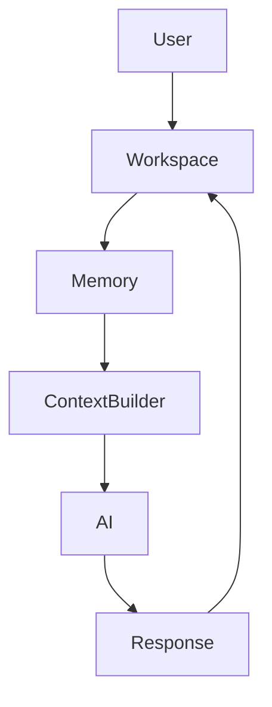
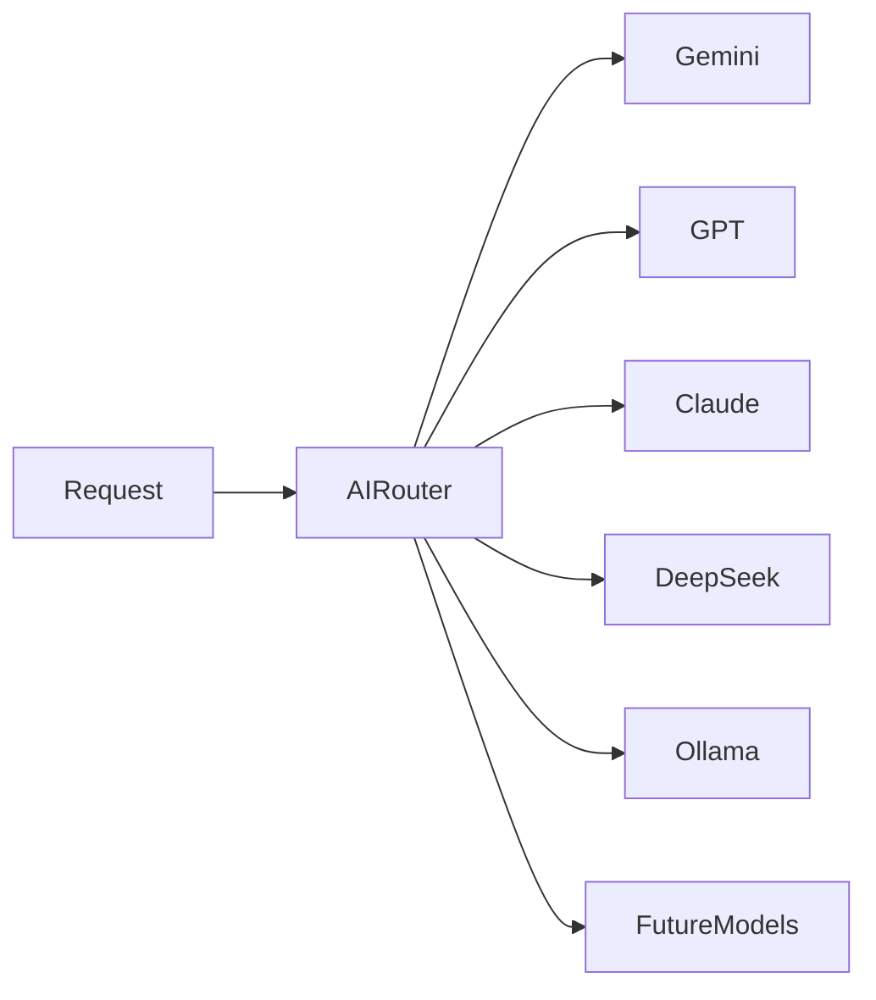
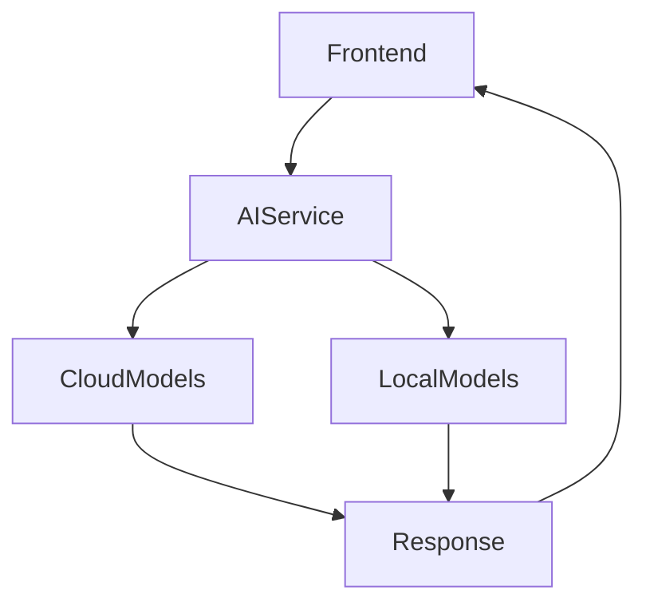
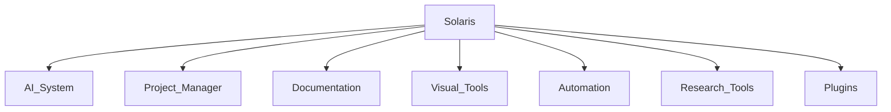
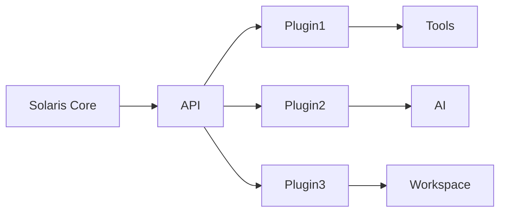

# ROADMAP.md

> *The Solaris roadmap describes the planned evolution of the project from its current foundation into a more complete AI-powered engineering environment. Development is approached incrementally, with each stage improving reliability, usability, and architectural flexibility before introducing larger capabilities.*

---

# Table of Contents

* Project Direction
* Roadmap Philosophy
* Current State
* Phase 1: Foundation and Stability
* Phase 2: Improving the Core Experience
* Development Priorities

---

# Project Direction

Solaris is being developed as a modular platform that combines artificial intelligence, software development tools, interactive interfaces, and intelligent workflows into one environment.

The current version establishes the foundation:

* AI-powered interaction
* Modern frontend architecture
* Backend service communication
* Modular component structure
* Expandable documentation system
* Interactive user experience

Future development focuses on expanding these foundations rather than replacing them.

The goal is not to continuously add isolated features.

A successful addition should improve the overall system, integrate naturally with existing architecture, and create opportunities for future development.

---

# Roadmap Philosophy

A roadmap is not a fixed list of promises.

Software development changes as new information appears.

Some ideas become more valuable after experimentation.

Some features require architectural improvements before they can be implemented properly.

Some planned ideas may be replaced by better solutions discovered during development.

For Solaris, the roadmap acts as a direction rather than a strict schedule.

Each phase represents a group of improvements that build toward a larger vision.

---

# Development Approach

The project follows several development principles.

## Build the Foundation First

Advanced features depend on reliable foundations.

Before introducing complex systems, Solaris focuses on improving:

* Code organization
* Performance
* Reliability
* Documentation
* User experience

A stable foundation makes future expansion significantly easier.

---

## Prefer Quality Over Quantity

Adding more features does not automatically make an application better.

A smaller number of well-designed systems creates more value than many disconnected features.

Each addition should answer a simple question:

"Does this improve the way users interact with Solaris?"

If the answer is unclear, the feature requires further evaluation.

---

## Design for Expansion

Many future capabilities require architectural preparation before implementation.

Examples include:

* Multiple AI models
* Persistent memory
* Local AI execution
* Advanced project management
* Plugin systems

The current architecture is designed so these features can be introduced gradually instead of requiring a complete redesign.

---

# Current State

Solaris currently provides the core structure required for future development.

The existing system includes:

## AI Interaction

The application can communicate with AI services through a structured workflow.

The frontend handles user interaction.

The backend manages communication.

The provider layer handles external AI integration.

This separation creates a foundation for future AI improvements.

---

## Modern Frontend Architecture

The interface is built around reusable components and modular design principles.

This allows future features to be introduced without creating unnecessary complexity.

The current structure supports continued expansion into additional tools and workspace features.

---

## Backend Infrastructure

The backend provides a controlled communication layer between the application and external services.

This creates opportunities for future improvements including:

* Better request management
* Multiple provider support
* Advanced authentication
* More intelligent routing

---

## Documentation System

Documentation is treated as part of the development process rather than an afterthought.

Current documents explain:

* System architecture
* AI design
* Features
* Performance considerations
* Development decisions

This documentation creates a reference point as the project evolves.

---

# Phase 1: Foundation and Stability

The first development phase focuses on strengthening the systems that already exist.

Before expanding Solaris into a larger platform, the current foundation needs to become reliable, maintainable, and easy to extend.

---

# Code Quality Improvements

The first priority is improving internal structure.

Planned improvements include:

* Reviewing existing components
* Removing unnecessary duplication
* Improving naming consistency
* Simplifying complex logic
* Strengthening project organization

As projects grow, maintaining clean code becomes increasingly important.

Small improvements early prevent larger problems later.

---

# Enhanced Error Handling

Reliable applications need predictable behavior when things fail.

Future improvements include:

* Better frontend error messages
* Improved backend validation
* Clearer API failure handling
* Recovery strategies for failed requests

The goal is not to hide problems.

The goal is to communicate them clearly and help users recover.

---

# Improved User Experience

The next stage focuses on making Solaris feel more refined.

Potential improvements include:

* Better loading states
* Smoother transitions
* Improved navigation
* More responsive interactions
* Interface refinements

Small improvements in interaction quality can significantly affect how an application feels during daily use.

---

# Performance Improvements

Performance optimization will continue alongside feature development.

Planned areas include:

* Reducing unnecessary renders
* Improving asset handling
* Optimizing animations
* Monitoring bundle size
* Improving application startup time

The objective is maintaining responsiveness as additional functionality is introduced.

---

# Testing Foundation

As Solaris becomes more complex, testing becomes increasingly valuable.

Future development will introduce stronger testing practices.

Potential areas include:

* Component testing
* Backend API testing
* Integration testing
* Performance testing
* Automated checks

Testing helps prevent new improvements from unintentionally damaging existing functionality.

---

# Development Priorities

The immediate priorities can be summarized as:

```text
Current Foundation

        ↓

Improve Reliability

        ↓

Improve User Experience

        ↓

Optimize Performance

        ↓

Introduce Advanced Features
```

The project will continue moving from a functional prototype toward a more complete engineering platform.

---

# ROADMAP.md

## Part 2 — Expansion and Advanced Systems

The first phase of Solaris focuses on establishing a stable foundation. Core functionality, modular architecture, AI integration, responsive design, and maintainable code form the base upon which everything else is built.

The second phase shifts the emphasis from creating features to building an intelligent development environment.

Rather than treating AI as a conversational assistant, Solaris gradually evolves into a workspace capable of understanding projects, retaining context, automating repetitive workflows, and adapting to the way developers work.

Each system described below extends the existing architecture instead of replacing it.

---

# AI Memory

Current AI conversations are largely session-based.

A prompt is submitted, the model generates a response, and the interaction remains confined to the current conversation.

While this works well for general assistance, it limits the ability of the system to develop long-term understanding.

Future versions of Solaris aim to introduce persistent memory designed specifically for engineering workflows.

The objective is not to remember everything.

The objective is to remember what is useful.

Instead of storing every conversation indefinitely, the system will organize information into structured categories.

Examples include:

* Project context
* Recent conversations
* User preferences
* Frequently accessed documentation
* Development history
* Workspace configuration

This information can be selectively retrieved when it improves the relevance of future responses.

A retrieval-based memory system scales more effectively than continually increasing prompt length while keeping AI interactions focused on the task at hand.



Memory should become a practical engineering tool rather than an archive of every interaction.

---

# Multiple Model Support

The AI ecosystem continues evolving at a remarkable pace.

Different language models demonstrate different strengths.

Some perform exceptionally well when writing code.

Others excel at reasoning through complex problems.

Some are optimized for speed.

Others prioritize accuracy or large context windows.

Solaris is designed with this diversity in mind.

Instead of tightly coupling the application to a single provider, future versions will introduce a provider abstraction layer capable of routing requests to different models.

Possible providers include:

* Google Gemini
* OpenAI GPT models
* Anthropic Claude
* DeepSeek
* Mistral
* Local models through Ollama
* Future open-source models

The user experience should remain consistent regardless of which provider generates the response.



This architecture reduces vendor lock-in while making Solaris more adaptable as AI technology continues to evolve.

---

# Workspace Intelligence

Most development environments treat each tool independently.

Editors edit code.

Documentation explains concepts.

AI answers questions.

Project files remain passive collections of information.

Solaris aims to connect these systems.

Workspace intelligence refers to the application's ability to understand relationships between different parts of the development environment.

Instead of viewing files as isolated documents, the workspace gradually becomes aware of:

* Active projects
* Recently edited files
* Current development tasks
* Documentation
* Project structure
* AI conversations

The result is an environment where intelligent assistance becomes increasingly contextual.

Rather than repeatedly explaining the current project, the workspace already understands its structure.

---

# Developer Tools

As Solaris matures, the application is expected to include tools that reduce repetitive engineering work rather than simply generating responses.

Examples include:

* Documentation generators
* Architecture visualizers
* API explorers
* Markdown editors
* Code snippet libraries
* Project templates
* Repository analyzers
* Engineering calculators

These tools share one objective.

Reduce context switching.

Developers frequently move between multiple applications while solving a single problem.

Solaris aims to consolidate common workflows into a unified workspace.

---

# Project Understanding

One of the largest improvements planned for future versions is deeper project awareness.

Current AI assistants generally operate using only the information provided in the current prompt.

Project understanding expands that capability.

Instead of asking isolated questions, the AI can gradually understand the surrounding codebase.

Potential information sources include:

* Repository structure
* Folder hierarchy
* Source files
* Documentation
* Configuration files
* Commit history
* Development notes

Rather than treating every prompt independently, the assistant becomes aware of the project as a whole.

This creates opportunities for more accurate explanations, better debugging assistance, and architectural recommendations that align with the existing codebase.

---

# Local AI

Cloud-hosted language models provide excellent capabilities, but they are not always the ideal solution.

Internet connectivity may be unavailable.

Privacy requirements may prevent external communication.

Certain workflows benefit from dedicated local inference.

Future versions of Solaris are expected to support local language models through compatible inference engines.

Possible advantages include:

* Offline development
* Lower long-term operating costs
* Improved privacy
* Custom model selection
* Engineering-specific fine-tuned models

The surrounding architecture already separates frontend communication from provider implementation, making local execution a natural extension rather than a complete redesign.



Users should be able to select the most appropriate provider without changing their workflow.

---

# Performance Improvements

As new capabilities are introduced, maintaining responsiveness becomes increasingly important.

Future optimization efforts will focus on improving both actual performance and perceived responsiveness.

Areas currently under consideration include:

### Frontend

* Route-level code splitting
* Lazy loading
* Improved state synchronization
* Smarter rendering strategies
* Progressive asset loading

### Backend

* Streaming AI responses
* Intelligent caching
* Request batching
* Response compression
* Better provider routing

### AI

* Context optimization
* Memory retrieval improvements
* Prompt compression
* Background preprocessing

### Infrastructure

* Better deployment pipelines
* Asset optimization
* Bundle analysis
* Monitoring
* Performance diagnostics

Performance work is expected to continue throughout the lifetime of the project rather than occurring only before major releases.

---

# Advanced Graphics

Interactive graphics remain one of the most ambitious parts of Solaris.

Current visual systems provide a foundation for future experimentation.

Planned improvements include richer environments, more sophisticated animations, and visual tools that directly support engineering workflows.

Potential directions include:

* Interactive architecture diagrams
* Three-dimensional workspace visualization
* Network topology rendering
* Real-time system monitoring
* Data visualization dashboards
* Animated development workflows
* GPU-accelerated rendering improvements

Graphics should communicate information rather than exist solely for visual appeal.

Every animation, visualization, and interactive scene should contribute to the user's understanding of the system being built.

---

# Looking Ahead

The systems described in this roadmap represent long-term architectural goals rather than fixed release commitments.

Some features may evolve differently than originally planned.

Others may be replaced entirely as new technologies emerge.

That flexibility is intentional.

The underlying architecture has been designed to accommodate change without requiring fundamental redesigns.

The direction remains consistent even as individual implementations evolve.

Solaris continues moving toward a workspace where artificial intelligence, software engineering, documentation, visualization, and development tools operate as parts of a cohesive environment instead of separate applications.

The expansion phase is less about adding features and more about increasing the system's ability to understand, assist, and adapt to the way developers work.
# ROADMAP.md

---

# Part 3 — Long-Term Vision

The future of Solaris is not defined by a fixed list of features.

The project is designed as a foundation that can evolve alongside new technologies, changing user needs, and lessons discovered through continued development.

The current application focuses on building the core systems required for an intelligent workspace: AI interaction, modular architecture, responsive interfaces, and extensible services.

Long-term development moves beyond adding individual features.

The goal is to create an ecosystem where different tools, workflows, and intelligent systems can operate together while maintaining a clear and adaptable architecture.

---

# Solaris Ecosystem

The long-term vision for Solaris extends beyond a single application.

The aim is to develop an ecosystem where AI assistance, software development, research, visualization, and productivity tools exist within one connected environment.

Instead of switching between separate applications for different stages of work, Solaris aims to provide a unified workspace.

A developer could research a concept, analyze documentation, generate implementation ideas, test solutions, visualize information, and manage projects while maintaining context throughout the process.

The ecosystem approach changes the role of AI.

Rather than being an isolated chatbot, AI becomes an integrated layer that supports different activities across the platform.

---

## Modular Workspace

Future versions of Solaris are expected to become increasingly modular.

Different capabilities would exist as independent systems connected through shared infrastructure.



Each module should be capable of evolving independently while contributing to the larger platform.

This structure prevents the application from becoming a collection of tightly connected features that are difficult to maintain.

---

# Plugin Architecture

One of the most important long-term goals is creating a plugin-based architecture.

A plugin system would allow external developers and advanced users to extend Solaris without modifying the core application.

Instead of every new capability becoming part of the main codebase, specialized tools could exist as independent extensions.

Possible examples include:

* Programming assistants
* Research utilities
* Data analysis tools
* Visualization modules
* Documentation generators
* Hardware development tools
* Custom AI workflows

---

## Plugin Design Philosophy

A successful plugin architecture requires more than allowing additional code to run.

It requires clear boundaries.

Plugins should have:

* Defined permissions
* Stable interfaces
* Independent configuration
* Version compatibility
* Controlled access to system resources

The goal is to encourage experimentation without sacrificing reliability.

---

## Future Plugin Model

A possible architecture:



The core application would provide the foundation while plugins contribute specialized functionality.

This approach allows Solaris to grow through collaboration rather than depending entirely on one development path.

---

# Autonomous Workflows

Artificial intelligence is moving beyond simple question-and-answer interactions.

Future systems will increasingly support workflows where AI can assist with multi-step tasks.

Solaris aims to explore this direction carefully.

The objective is not to create uncontrolled automation.

The objective is to create reliable assistance where users define goals, review progress, and maintain control over important decisions.

---

## Workflow-Based Intelligence

A future Solaris workflow could involve several connected stages.

Example:

```text
User Goal

↓

AI Planning

↓

Task Breakdown

↓

Tool Selection

↓

Execution

↓

Review

↓

Human Approval

↓

Final Output
```

This model treats AI as a collaborator inside a structured process rather than an independent decision-maker.

---

## Possible Autonomous Capabilities

Future exploration may include:

* Automated project setup
* Code analysis
* Documentation generation
* Testing assistance
* Research organization
* Development environment preparation
* Workflow suggestions

These capabilities require careful engineering because increasing automation also increases the importance of transparency and user control.

---

# Research Directions

Solaris provides an opportunity to explore several areas of modern computing.

Future research areas may include:

---

## Artificial Intelligence Systems

Areas of exploration:

* Multi-model AI systems
* Context-aware assistants
* Retrieval-Augmented Generation
* Local language models
* AI evaluation methods
* Intelligent routing systems

The focus is not only improving model capability, but improving how AI integrates into real workflows.

---

## Human-Computer Interaction

The way people interact with software is changing.

Future Solaris research may explore:

* Natural language interfaces
* Adaptive interfaces
* Visual information systems
* Voice interaction
* Mixed interaction models

The challenge is creating interfaces that feel powerful without becoming complicated.

---

## Software Engineering Tools

Modern development environments continue becoming more intelligent.

Solaris may explore:

* AI-assisted debugging
* Automated code analysis
* Intelligent documentation systems
* Development workflow automation
* Project understanding systems

The goal is improving developer productivity while keeping engineers involved in important decisions.

---

# Community Contribution

A long-term project becomes stronger when more people can participate.

Although Solaris began as an individual learning project, future growth may involve contributors who bring different experiences, ideas, and technical perspectives.

Community contribution is not limited to writing code.

Useful contributions may include:

* Feature suggestions
* Documentation improvements
* Bug reports
* UI feedback
* Architecture discussions
* Plugin development
* Testing

---

# Building an Open Development Culture

Future contribution systems should encourage thoughtful improvement rather than simply increasing the number of changes.

Good contributions should:

* Solve real problems
* Maintain architectural clarity
* Include appropriate documentation
* Respect existing design decisions
* Improve the experience for future users

The purpose of collaboration is not only adding functionality.

It is improving the quality and direction of the project.

---

# Future Engineering Goals

The technical goals of Solaris will continue evolving as the project develops.

Several long-term engineering objectives currently guide future planning.

---

## More Scalable Architecture

Future improvements include:

* Stronger service boundaries
* Improved module isolation
* Better configuration systems
* More flexible deployment options

The goal is maintaining simplicity while supporting increasing complexity.

---

## Advanced AI Infrastructure

Potential developments include:

* Multi-provider AI routing
* Local model support
* Better memory systems
* Context retrieval
* AI tool integration

These systems would expand Solaris from an AI interface into a broader intelligent platform.

---

## Better Developer Experience

Future engineering improvements may focus on:

* Improved documentation
* Easier setup process
* Development tooling
* Testing infrastructure
* Contribution workflows

A project becomes easier to improve when the development environment itself is well designed.

---

# Final Vision

Solaris is being built around the idea that future software will become increasingly intelligent, modular, and interactive.

The project does not aim to predict exactly what technology will look like years from now.

Instead, it focuses on building a foundation capable of adapting.

The most valuable systems are rarely those that depend on one specific tool or technology.

They are systems designed around strong principles:

Clear architecture.

Modularity.

Human control.

Continuous improvement.

The long-term vision for Solaris is an ecosystem where intelligent tools assist people in building, learning, researching, and creating.

The technology will continue changing.

The architecture must be ready to change with it.

---

**End of `ROADMAP.md`**
